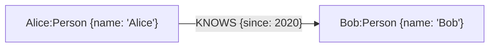

# Neo4J 簡單應用

## 一、什麼是知識圖譜

**知識圖譜（Knowledge Graph, KG）** 源於自然語言理解，其目標是用一種結構化的方式，來描述現實世界中的實體及其相互關係。它主要由兩個核心要素構成：

1.  **節點（Nodes）**：代表現實世界中的“實體”（Entities），例如一個人、一部電影、一家公司或一個具體概念。
2.  **邊（Edges）**：代表實體與實體之間的“關係”（Relations）。

這些元素共同構成了一個龐大的語義網路，其基本結構可以表示為 **（實體）- [關係] -> （實體）** 的三元組（Triples）。例如，“餃子”和“哪吒2”是兩個實體，“導演”就是它們之間的關係，構成一個知識三元組：（餃子）- [導演] -> （哪吒2）。

## 二、知識圖譜的應用

知識圖譜並非一個孤立的學術概念，它在工業界有著廣泛且深入的應用，尤其是在需要深度結合領域知識的場景中。

### 2.1 風險識別與網路分析

俗話說“近朱者赤，近墨者黑”，在許多領域，一個實體的風險或屬性，往往與其關聯的其他實體有很強的相關性。知識圖譜正是挖掘這種關聯性的利器。

-   **犯罪網路偵查**：公安部門可以利用通話記錄、社交關係、轉賬流水等資訊構建犯罪嫌疑人網路。在這個網路中，如果某個節點與多個已知的犯罪分子有直接或間接的聯絡，那麼他參與犯罪的可能性就大大增加。透過分析網路中的核心人物（連線數最多的節點）和資金流向，可以有效地打擊整個犯罪團伙。
-   **信用卡反欺詐**：銀行可以將申請人的資訊（如電話、地址、公司）構建成一個龐大的關係網路。透過分析這張網路，可以識別出“欺詐團伙”——例如，多個申請人共享同一個聯絡電話或家庭住址，或者與已知的欺詐分子有緊密的社交關係。

### 2.2 智慧診斷與運維

-   **工業裝置運維**：將裝置的各種“故障現象”、“故障原因”、“解決方案”和“所需零件”構建成知識圖譜。當裝置出現問題時，系統可以根據上報的現象，在圖譜中進行推理，快速定位可能的原因，並給出維修建議，甚至可以提示維修人員需要攜帶哪些工具和備件，從而提高維修效率。
-   **醫療輔助診斷**：醫療領域知識繁雜，可以透過構建“病症”、“疾病”、“檢查專案”、“治療方案”、“藥品”之間的關係圖譜。醫生輸入患者的症狀後，系統可以輔助推薦需要進行的檢查，並根據檢查結果在圖譜中推理，給出可能的診斷建議和治療方案，幫助實現規範化診療。

### 2.3 特定領域聊天機器人

對於通用領域的開放式聊天，大語言模型（LLM）已展現出強大的能力。但在許多垂直領域，基於知識圖譜的問答系統（KBQA）因其答案的準確性和可解釋性，仍然具有不可替代的價值。其工作流程通常如下：

1.  **意圖識別**：首先判斷使用者提問的意圖。例如，“我想買一張明天上午的故宮門票”這個問題的意圖是“票務預訂”。
2.  **槽位填充 (實體抽取)**：從問題中抽取出關鍵資訊，即“實體”。例如：`景點: 故宮`, `時間: 明天上午`, `數量: 一張`。
3.  **知識查詢**：利用抽取出的實體，在知識圖譜（或資料庫）中進行精確查詢。
4.  **回覆生成**：將查詢到的結果，透過預設的模板生成自然語言回覆。

這種方式雖然不如 LLM 靈活，但在機票預訂、酒店查詢、銀行客服等業務邏輯明確的場景中，能夠提供更加可靠和可控的服務。

## 三、知識圖譜的構建

如何從海量的、非結構化的文字（如新聞、財報、醫療記錄）中，自動地構建出結構化的知識圖譜，是整個技術流程的核心挑戰。

### 3.1 經典構建流程

傳統的知識圖譜構建過程主要依賴於兩項關鍵的 NLP 技術：

1.  **命名實體識別 (Named Entity Recognition, NER)**：從文字中識別並抽取出特定類別的實體。例如，在“英偉達釋出了專為 AI 設計的 Blackwell 晶片”這句話中，識別出“英偉達”（公司）、“Blackwell”（產品）。這些被抽取的實體將成為知識圖譜中的 **節點**。
2.  **關係抽取 (Relation Extraction, RE)**：在識別出實體的基礎上，進一步判斷實體與實體之間存在何種語義關係。在上面的例子中，模型需要判斷“英偉達”和“Blackwell”之間的關係是“釋出”。這個關係將成為連線兩個節點的 **邊**。

透過對大量文字進行這兩步處理，我們就能源源不斷地抽取出知識三元組，最終匯聚成一個龐大的知識圖譜。

### 3.2 大模型帶來的革新

隨著大語言模型的興起，傳統的 NLP 任務流程正在被重塑。LLM 同樣具備強大的實體識別和關係抽取能力，但這並不意味著對傳統流程的簡單替代，而是呈現出深度融合的趨勢。

-   **侷限性與挑戰**：完全依賴 LLM 會面臨成本高昂、資料隱私（使用閉源 API 時）、以及“幻覺”問題，即模型可能會編造事實。
-   **融合方案**：為了結合知識圖譜的準確性和大模型的推理能力，微軟提出了 GraphRAG。原理是將知識圖譜作為一個可靠、可隨時更新的 **外部知識庫**，並基於圖結構進行“子圖檢索”（如社群發現、路徑搜尋等），而非檢索孤立事實。當使用者提問時：
    1.  利用模型從問題中識別出核心實體與約束。
    2.  在圖中檢索與之高度相關的子圖（社群/路徑/鄰域），獲得準確且可解釋的事實與關係。
    3.  將該子圖的結構化資訊作為上下文，連同原始問題一起輸入給大語言模型，生成基於證據的答案。

## 四、圖資料庫：Neo4j

> [Neo4j 官方文件](https://neo4j.com/docs/)

知識圖譜需要專門的資料庫進行儲存和查詢，這類資料庫被稱為 **圖資料庫 (Graph Database)**。其中，與傳統的關係型資料庫（如 MySQL）相比，圖資料庫的優勢在於其對“關係”的查詢效能。對於需要進行多層關係遍歷的複雜查詢（例如，查詢“我朋友的朋友”），圖資料庫的效果遠超關係型資料庫。而 **Neo4j** 就是目前比較流行的一款開源圖資料庫。

### 4.1 核心概念

Neo4j 的資料模型主要包含以下幾個概念：

-   **節點 (Node)**：節點是圖中的基本資料單元，用於表示現實世界中的實體，例如一個人、一家公司、一本書或一個賬戶。在關係型資料庫中，節點可以類比為表中的一行。

-   **標籤 (Label)**：用於為節點分類或打上“型別”標記。一個節點可以擁有一個或多個標籤。例如，一個節點可以同時擁有 `:Person` 和 `:Author` 兩個標籤，表示這個人既是一個普通人，也是一位作者。

-   **關係 (Relationship)**：這是圖資料庫的精髓所在，它以一種富有表現力的方式連線兩個節點，並明確地定義了它們之間的聯絡。每個關係都具有以下特點：
    -   **有方向**：關係總是從一個“起始節點”指向一個“結束節點”。
    -   **有型別**：每個關係都必須有一個型別（例如 `:FRIENDS_WITH`, `:PURCHASED`），用來描述連線的性質。
    -   **可以擁有屬性**：和節點一樣，關係也可以儲存屬性，例如，一個 `:PURCHASED` 關係可以有一個 `date` 屬性來記錄購買日期。

-   **屬性 (Property)**：屬性是以鍵值對（Key-Value）形式儲存在節點和關係上的詳細資訊。鍵是字串，值可以是各種基本資料型別（如字串、數字、布林值）或它們的陣列。

這四個概念共同構成了一個靈活而強大的資料模型。


> 在上圖中，`Alice` 和 `Bob` 是 **節點**，`:Person` 是 **標籤**，`{name: 'Alice'}` 是 **屬性**，`KNOWS` 則是連線它們的 **關係** 型別，而 `{since: 2020}` 是這段關係上的 **屬性**。

### 4.2 查詢語言：Cypher

Cypher 是 Neo4j 的宣告式圖形查詢語言，它的語法靈感來源於 SQL，但針對圖的特性進行了最佳化。透過 Cypher，我們可以用一種直觀且高效的方式來查詢和操作圖資料。

例如，要查詢在電影《駭客帝國》(The Matrix) 中出演過的所有演員，可以使用以下查詢：

```cypher
MATCH (actor:Person)-[:ACTED_IN]->(movie:Movie {title: 'The Matrix'})
RETURN actor.name
```

官方的 Cypher 語法速查表（[線上版本](https://neo4j.com/docs/cypher-refcard/4.4/)）彙總了常用的命令、運算子和語法結構，可供讀者快速查閱。

<div align="center">
  
  <p>圖 1.1: Cypher 語法速查表 (Cypher Refcard)</p>
</div>

### 4.3 安裝與使用

對於初學者和開發者，推薦以下兩種主流的安裝方式。

1.  **Neo4j Desktop (推薦用於本地學習)**
    -   **安裝**:
        1.  訪問 [Neo4j 官網](https://neo4j.com/download/)，在 “Neo4j for Desktop” 板塊點選 “Download” 按鈕。
            <div align="center">
              
              <p>圖 1.2: 在官網點選下載</p>
            </div>
        2.  頁面會跳轉至一個登錄檔單。可以填寫任意資訊，然後點選 “Download Desktop” 按鈕，瀏覽器將自動開始下載安裝包。
            <div align="center">
              
              <p>圖 1.3: 填寫登錄檔單</p>
            </div>
        3.  下載完成後，雙擊安裝檔案，程式會自動進行安裝。
        4.  安裝完成後首次啟動，會看到許可協議介面，點選 “Continue” 即可完成最後的設定。
            <div align="center">
              
              <p>圖 1.4: 首次啟動並同意許可協議</p>
            </div>

2.  **Docker (推薦用於伺服器部署與跨平臺開發)**
    -   **安裝**: 只需一行命令即可完成拉取映象和啟動容器。
        ```bash
        docker run \
            --name my-neo4j \
            -p 7474:7474 -p 7687:7687 \
            -d \
            -v $HOME/neo4j/data:/data \
            -v $HOME/neo4j/logs:/logs \
            --env NEO4J_AUTH=neo4j/password \
            neo4j:latest
        ```
    -   **引數說明**:
        -   `-p 7474:7474`: 將容器的 HTTP 埠對映到本機，用於瀏覽器訪問。
        -   `-p 7687:7687`: 將容器的 Bolt 驅動埠對映到本機，用於程式碼連線。
        -   `-v $HOME/neo4j/data:/data`: 將資料目錄掛載到本機，確保資料持久化。
        -   `--env NEO4J_AUTH=neo4j/password`: 設定資料庫的初始使用者名稱和密碼（此處為 `neo4j/password`）。
        -   `neo4j:latest`: 使用最新的官方映象。

安裝好 Neo4j 後。我們就可以學習一些 Neo4j 的基本用法了。

## 五、建立並連線資料庫

在使用 Neo4j 進行開發時，首先需要在 Neo4j Desktop 中建立一個本地資料庫例項（Instance）。這個過程非常直觀。

1.  **建立例項**：開啟 Neo4j Desktop，在 “Local instances” 頁面點選 “Create instance” 按鈕。

    <div align="center">
      
      <p>圖 2.1: 點選建立例項</p>
    </div>

2.  **配置例項**：在彈出的視窗中，為例項命名（例如 `base nlp`），選擇所需的 Neo4j 版本，併為預設使用者 `neo4j` 設定一個能記住的密碼。完成後點選 “Create”。

    <div align="center">
      
      <p>圖 2.2: 配置例項資訊</p>
    </div>

3.  **啟動與連線**：例項建立後會自動啟動，狀態顯示為 “RUNNING”。此時，可以透過瀏覽器直接訪問 `http://127.0.0.1:7474` 來開啟 Neo4j Browser。

    <div align="center">
      
      <p>圖 2.3: 例項建立成功並執行</p>
    </div>

    在瀏覽器開啟的連線介面中，使用剛剛設定的密碼進行連線。

    <div align="center">
      
      <p>圖 2.4: 使用密碼連線資料庫</p>
    </div>

## 六、增刪查改

資料庫操作的核心無外乎增刪查改（CRUD），下面來使用 Cypher，圍繞一個菜品資訊圖譜的場景，逐一介紹這些基本操作。

### 6.1 場景設定

為了方便演示，先設定好本次實踐所需要用到的實體、屬性和關係。

-   **實體/標籤 (Labels)**:
    -   `Ingredient`: 食材，擁有 `name`, `category`（類別）, `origin`（產地）, `tags`（標籤，陣列）等屬性。
    -   `Dish`: 菜品，擁有 `name`, `cuisine`（菜系）等屬性。
-   **關係 (Relationships)**:
    -   `(Dish)-[:包含]->(Ingredient)`: 表示某菜品包含某種食材，關係上可以有 `用量` 屬性。
    -   `(Dish)-[:主要食材]->(Ingredient)`: 表示某菜品的主要食材是某種食材。
    -   `(Dish)-[:調味]->(Ingredient)`: 表示某菜品使用某種食材進行調味。

### 6.2 建立 (CREATE)

`CREATE` 語句用於在圖中建立新的節點和關係。

#### 6.2.1 建立節點

建立節點的基本語法是 `CREATE (變數:標籤 {屬性: 值})`。

-   **變數 (Variable)**: 如 `pork`，是一個臨時名稱，用於在同一條語句中引用該節點。如果後續不需要引用，可以省略。
-   **標籤 (Label)**: 如 `Ingredient`，用於對節點進行分類。
-   **屬性 (Properties)**: 一個包含鍵值對的 map/字典，用於描述節點的具體資訊。

最基礎的建立語句包含一個臨時變數（`pork`）、一個標籤（`Ingredient`）和一組屬性。

```cypher
CREATE (pork:Ingredient {name:'豬肉', category:'肉類', origin:'杭州'});
```

如果在建立後不需要立刻使用這個節點（例如，在同一查詢中建立關係），可以省略臨時變數名，這樣語法更簡潔。

```cypher
CREATE (:Ingredient {name:'土豆', category:'蔬菜', origin:'北京'});
```

還可以在建立節點後，使用 `RETURN` 子句立即將其返回。這對於除錯或確認節點是否按預期建立非常有用。`RETURN n` 會在結果面板中直接顯示剛剛建立的 `雞蛋` 節點的資訊。

```cypher
CREATE (n:Ingredient {name:'雞蛋'}) RETURN n;
```

執行上述三條命令後，資料庫中就建立了三個 `Ingredient` 型別的節點。能夠透過 Neo4j Browser 的視覺化介面直觀地看到這些新建立的資料。

<div align="center">
  
  <p>圖 2.5: 執行建立命令後，左側面板顯示已有 3 個 Ingredient 節點</p>
</div>

點選左側面板中的 `Ingredient` 標籤，Neo4j Browser 會自動執行 `MATCH (n:Ingredient) RETURN n LIMIT 25;` 查詢，並在主視窗中展示所有食材節點。如圖 2.6 所示，點選其中一個節點（如“土豆”），右側會顯示其詳細屬性。這裡可以觀察到：

-   **`<id>` 欄位**：這是 Neo4j 為每個節點自動生成的內部唯一識別符號。
-   **Key-Value 結構**：右側的 “Key” 和 “Value” 兩列展示了節點屬性是以鍵值對的形式儲存的。
-   **自定義屬性**：`name`、`category`、`origin` 三個欄位的值與前面 `CREATE` 語句中設定的值完全一致。

<div align="center">
  
  <p>圖 2.6: 查詢並檢視新建立的節點及其屬性</p>
</div>

#### 6.2.2 建立關係

關係的建立通常需要先指定關係兩端的節點，然後用 `-[變數:型別 {屬性}]->` 來定義關係。

-   關係必須有 **方向** 和 **型別 (Type)**。
-   小括號 `()` 用於表示節點，中括號 `[]` 用於表示關係。

在實際應用中，常常需要一次性建立多個節點以及它們之間的關係。`CREATE` 語句支援透過逗號分隔，在一個查詢中完成複雜圖譜的構建。下面的例子將建立一個更復雜的菜品關係網路，以體現“多對多”的特性（一道菜包含多種食材，一種食材可用於多道菜）。

```cypher
CREATE
	// 建立食材節點
	(rousi:Ingredient {name:'豬裡脊'}),
	(muer:Ingredient {name:'木耳'}),
	(huluobo:Ingredient {name:'胡蘿蔔'}),
	(qingjiao:Ingredient {name:'青椒'}),
	// 建立菜品節點
	(d1:Dish {name:'魚香肉絲', cuisine:'川菜'}),
	(d2:Dish {name:'木須肉', cuisine:'魯菜'}),
	// 建立關係
	(d1)-[:包含 {amount:'250g'}]->(rousi), (d1)-[:包含]->(muer), (d1)-[:包含]->(huluobo),
	(d2)-[:包含 {amount:'150g'}]->(rousi), (d2)-[:包含]->(muer),
	// 建立雙向關係
	(rousi)-[:被用於]->(d1), (muer)-[:被用於]->(d1), (huluobo)-[:被用於]->(d1),
	(rousi)-[:被用於]->(d2), (muer)-[:被用於]->(d2);
```
這個查詢語句做了以下幾件事：
1.  **建立了 4 個 `Ingredient` 節點**：豬裡脊、木耳、胡蘿蔔、青椒。
2.  **建立了 2 個 `Dish` 節點**：魚香肉絲、木須肉。
3.  **建立了 5 條 `包含` 關係**：從菜品指向食材。
4.  **建立了 5 條 `被用於` 關係**：從食材指向菜品。這樣既可以方便地查詢“一道菜包含哪些食材”，也可以高效地反向查詢“一種食材被用在了哪些菜裡”。

執行 `MATCH p=()-[:包含]->() RETURN p LIMIT 25;` 查詢可以視覺化展示所有“包含”關係。點選關係（箭頭），可以在右側看到其詳細資訊，例如“魚香肉絲”到“豬裡脊”的關係上，就包含了在 `CREATE` 語句中定義的 `amount: '250g'` 這一屬性。

<div align="center">
  
  <p>圖 2.7: 建立關係後的圖譜結構</p>
</div>

### 6.3 查詢 (MATCH)

`MATCH` 是 Cypher 中用於查詢圖資料的命令，它允許你描述你想要尋找的節點和關係的模式。

#### 6.3.1 基本查詢

最簡單的查詢是匹配並返回圖中的任意節點，可以使用 `LIMIT` 關鍵字限制返回數量，避免因資料量過大導致瀏覽器卡頓。

```cypher
// 匹配並返回圖中的任意 25 個節點
MATCH (n)
RETURN n
LIMIT 25;
```

也可以根據標籤和屬性進行精確匹配。

```cypher
// 匹配所有標籤為 Ingredient，且名字為'豬裡脊'的節點
MATCH (n:Ingredient {name:'豬裡脊'}) RETURN n;
```

#### 6.3.2 條件查詢 (WHERE)

`WHERE` 子句提供了更靈活的過濾能力，可以對節點的屬性進行復雜的邏輯判斷。

例如，查詢名字是'豬裡脊'或'雞蛋'的 `Ingredient` 節點。

```cypher
MATCH (n:Ingredient)
WHERE n.name IN ['豬裡脊','雞蛋']
RETURN n;
```

也可以使用 `AND`、`OR` 等關鍵字構建複合查詢條件。

```cypher
// 複合條件：查詢指定名稱且類別為“肉類”的節點
MATCH (n:Ingredient)
WHERE n.name IN ['豬肉', '豬裡脊', '雞蛋'] AND n.category = '肉類'
RETURN n;
```

#### 6.3.3 返回指定屬性

預設情況下，`RETURN n` 會返回整個節點物件。也可以只返回節點的特定屬性，並使用 `AS` 為返回的列起別名，使結果更具可讀性。

```cypher
MATCH (n:Ingredient)
WHERE n.name IN ['豬裡脊','雞蛋']
RETURN n.name AS 食材名稱, n.category AS 類別;
```

#### 6.3.4 關聯查詢

圖資料庫最強大的地方在於對關係的查詢。例如，可以一次性查詢“魚香肉絲”和“木須肉”分別包含了哪些食材。

```cypher
MATCH (d:Dish)-[:包含]->(i:Ingredient)
WHERE d.name IN ['魚香肉絲', '木須肉']
RETURN d.name AS 菜品, collect(i.name) AS 食材列表;
```
> `collect()` 是一個聚合函式，可以將匹配到的多個同類結果（這裡是食材名稱 `i.name`）收集到一個列表中。

#### 6.3.5 查詢並建立 (MATCH + CREATE)

在實際應用中，一個常見的操作是先找到圖中已經存在的節點，然後為它們新增新的關係。這可以透過組合使用 `MATCH` 和 `CREATE` 來實現。

例如，我們已經建立了“魚香肉絲”和“豬裡脊”，現在想為它們新增一條“主要食材”的關係。

```cypher
MATCH
    (d:Dish {name:'魚香肉絲'}),
    (i:Ingredient {name:'豬裡脊'})
MERGE
    (d)-[r:主要食材]->(i)
RETURN d, i, r;
```
> 這個模式確保了是在已有的、正確的實體之間建立關聯，並透過 `MERGE` 避免重複的關係。

#### 6.3.6 排序 (ORDER BY)

可以使用 `ORDER BY` 子句對返回的結果進行排序。預設是升序 (`ASC`)，也可以指定為降序 (`DESC`)。

```cypher
// 查詢所有食材，並按名稱升序排序
MATCH (i:Ingredient)
RETURN i.name, i.category
ORDER BY i.name ASC;
```

### 6.4 更新 (SET & MERGE)

#### 6.4.1 更新屬性 (SET)

`SET` 語句用於修改或新增節點/關係的屬性。它必須和 `MATCH` 配合使用，先找到要更新的實體，再進行修改。

```cypher
MATCH (i:Ingredient {name:'豬肉'})
SET
    i.is_frozen = true,
    i.origin = '金華'
RETURN i;
```

#### 6.4.2 插入或更新 (MERGE)

在構建知識圖譜時，經常遇到這樣的場景：如果某個節點已存在，則更新其屬性；如果不存在，則建立它。`MERGE` 語句就可以解決這個問題。

`MERGE` 會根據你提供的模式在圖中查詢，如果找到匹配項，則執行 `ON MATCH` 部分；如果未找到，則執行 `ON CREATE` 部分，從而避免了重複建立實體。

```cypher
// 查詢名為'大蒜'的 Ingredient 節點
MERGE (n:Ingredient {name: '大蒜'})
// 如果不存在，則建立該節點，並設定建立時間和初始庫存
ON CREATE SET
    n.created = timestamp(),
    n.stock = 100
// 如果已存在，則更新其庫存、訪問次數和訪問時間
ON MATCH SET
  n.stock = coalesce(n.stock, 0) - 1,
  n.counter = coalesce(n.counter, 0) + 1,
  n.accessTime = timestamp()
RETURN n;
```
> `coalesce(property, defaultValue)` 是一個非常有用的函式，它會檢查屬性 `property` 是否存在，如果存在則返回其值，否則返回 `defaultValue`。

### 6.5 刪除 (DELETE & REMOVE)

#### 6.5.1 刪除屬性 (REMOVE)

`REMOVE` 用於移除節點或關係上的某個屬性。在下面的例子中，先用 `MATCH` 找到名為“大蒜”的節點，然後移除由 `MERGE` 命令在建立它時新增的 `created` 屬性。

```cypher
MATCH (i:Ingredient {name:'大蒜'})
REMOVE i.created
RETURN i;
```

#### 6.5.2 刪除節點和關係 (DELETE)

`DELETE` 用於刪除節點和關係。但需要 **特別注意**：Neo4j 不允許直接刪除一個還存在關聯關係的節點。你必須先刪除關係，才能刪除節點。

```cypher
// 錯誤示範：如果'大蒜'還有關係連著，這條語句會報錯
MATCH (i:Ingredient {name:'大蒜'})
DELETE i;
```

正確的做法有兩種。第一種是先手動刪除與節點相關的所有關係，然後再刪除節點本身。

```cypher
// 正確做法 1：先刪除關係，再刪除節點
MATCH (i:Ingredient {name:'大蒜'})-[r]-() // 匹配與'大蒜'相連的任意關係
DELETE r, i; // 先刪除關係 r，再刪除節點 i
```

第二種做法更簡潔，也是官方推薦的方式：使用 `DETACH DELETE`。它會自動刪除指定節點以及所有與它直接相連的關係。

```cypher
// 正確做法 2：使用 DETACH DELETE (推薦)
MATCH (i:Ingredient {name:'大蒜'})
DETACH DELETE i;
```

此外，還可以透過節點的內部 ID 進行精確查詢和刪除。每個節點都有一個由 Neo4j 自動分配的唯一 ID，可以透過 `id()` 函式獲取。

```cypher
// 假設我們透過查詢得知“大蒜”的 ID 為 5
MATCH (i:Ingredient)
WHERE id(i) = 5
DETACH DELETE i;
```

#### 6.5.3 清空資料庫

如果想刪除資料庫中的所有節點和關係，可以使用以下命令：

```cypher
// 匹配所有節點 n
MATCH (n)
// 強制刪除節點 n 及其所有關係
DETACH DELETE n;
```

#### 6.5.4 軟刪除

在生產環境中，直接從資料庫中物理刪除（`DELETE`）資料是一種高風險操作。一種更安全、更常見的做法是“軟刪除”。軟刪除並非真的將資料移除，而是透過 `SET` 命令為其新增一個狀態屬性，將其標記為“已刪除”或“不活躍”。

```cypher
// 將“木耳”標記為不活躍
MATCH (i:Ingredient {name:'木耳'})
SET i.is_active = false;
```
這樣，在後續的查詢中，只需要增加一個 `WHERE i.is_active = true` 的過濾條件，就能只使用那些“活躍”的資料，而被軟刪除的資料依然保留在資料庫中，以備審計或恢復。

> 刪除操作是高風險行為，尤其是在生產環境中。執行前請務必確認操作物件和範圍，並做好資料備份。
