# 第一節 環境配置與專案架構

> 經過前面十幾天的鏖戰也是終於來到了專案實戰環節。接下來，透過一個完整的實戰專案來把前面學到的知識串聯起來，構建一個真正可用的RAG系統。

## 一、專案背景

這個專案的靈感來自於筆者前段時間刷影片時，偶然看到了一個有趣的開源專案介紹——[程式設計師做飯指南](https://github.com/Anduin2017/HowToCook)。這是一個菜譜專案，用Markdown格式記錄了各種菜品的製作方法，從簡單的家常菜到複雜的宴客菜，應有盡有。更完美的是，這個專案中每道菜的Markdown檔案都嚴格使用統一的小標題。

看到這個專案，筆者立刻想到：能不能構建一個智慧問答系統來解決我的選擇困難症？每天面對"今天吃什麼"這個世紀難題，如果有個AI助手能根據我的需求推薦菜品、告訴我怎麼做，那該多好！於是就有了搭建這個**嚐嚐鹹淡RAG系統**的想法。

## 二、環境配置

### 2.1 建立虛擬環境

```bash
# 使用conda建立環境
conda create -n cook-rag-1 python=3.12.7
conda activate cook-rag-1
```

### 2.2 安裝核心依賴

老規矩，進入本章對應專案目錄安裝依賴包

```bash
cd code/C8
pip install -r requirements.txt
```

如果 API Key 已經配置好了，可以直接使用下面命令執行專案

```bash
python main.py
```

### 2.3 申請Kimi API Key

Kimi2 釋出第八天來嚐嚐鹹淡，申請地址：[Kimi API官網](https://platform.moonshot.cn/console/api-keys)。目前註冊會送15元的額度，綽綽有餘了。

### 2.4 API配置

參考前面章節 [**環境準備**](../chapter1/02_preparation.md) 中關於api_key的配置方法。在windows下，配置完成後應該如下圖所示：


## 三、專案架構

### 3.1 專案目標

我們將基於HowToCook專案的菜譜資料，構建一個智慧的食譜問答系統。使用者可以：

- 詢問具體菜品的製作方法："宮保雞丁怎麼做？"
- 尋求菜品推薦："推薦幾個簡單的素菜"
- 獲取食材資訊："紅燒肉需要什麼食材？"

### 3.2 資料分析

#### 3.2.1 文件分析

HowToCook專案包含了大約300多個Markdown格式的菜譜檔案。這些菜譜有兩個關鍵特點：一是結構高度規整，每個檔案都嚴格按照統一的格式來組織內容；二是內容篇幅較短，單個菜譜通常在700字左右。

開啟任意一個菜譜檔案，可以發現它們都遵循著相似的結構模式。通常以菜品做法作為一級標題，開頭會有一段簡介和難度評級，然後分為"必備原料和工具"、"計算"、"操作"、"附加內容"等幾個主要部分。比如西紅柿炒雞蛋這道菜：

```markdown
# 西紅柿炒雞蛋的做法

西紅柿炒蛋是中國家常幾乎最常見的一道菜餚...
預估烹飪難度：★★

## 必備原料和工具
* 西紅柿
* 雞蛋
* 食用油...

## 計算
每次製作前需要確定計劃做幾份...
* 西紅柿 = 1 個（約 180g） * 份數
* 雞蛋 = 1.5 個 * 份數，向上取整...

## 操作
- 西紅柿洗淨
- 可選：去掉西紅柿的外表皮...

## 附加內容
這道菜根據不同的口味偏好，存在諸多版本...
```

從資料上來看，這種高度結構化的資料不需要過多處理就可以直接用於RAG系統構建。還記得我們在第2章學過的[**Markdown結構分塊**](../chapter2/05_text_chunking.md#34-基於文件結構的分塊)嗎？這個資料完全契合那種按標題層級分塊的思路。更重要的是，每個菜譜檔案的內容都不算太長，單個章節的內容通常在幾百字左右，這意味著可以直接按照標題進行分塊，而不用擔心第2章提到的那個問題——某個章節內容過長超出模型上下文視窗，需要與常規分塊方法（如`RecursiveCharacterTextSplitter`）組合使用。

#### 3.2.2 結構分塊侷限

雖然Markdown結構分塊看起來很理想，但在實際使用中可能會遇到一個問題：按照標題嚴格分塊會把內容切得太細，導致上下文資訊不完整。比如使用者問"宮保雞丁怎麼做"，如果嚴格按標題分塊，可能只檢索到"操作"這一個章節，但缺少了"必備原料和工具"的資訊，LLM就無法給出完整的製作指導。甚至有時候檢索到的是"附加內容"中的某個變化做法，沒有基礎製作步驟，回答就會顯得莫名其妙。如果你嘗試直接把整個菜譜文件作為一個塊，可以發現效果反而比結構分塊要好，因為上下文資訊是完整的。

為了解決這個矛盾，可以採用父子文字塊的策略：用小的子塊進行精確檢索，但在生成時傳遞完整的父文件給LLM。這種方法在第3章的索引最佳化中雖然沒有專門介紹，但本質上也屬於上下文拓展的一種應用。透過這種方式，我們既保證了檢索的精確性，又確保了生成時上下文的完整性。

> 反正都是把整個文件傳給LLM，我為什麼不直接用整個文件分塊呢？

這個問題問得很好！關鍵在於當使用者問"宮保雞丁需要什麼調料"時，如果直接用整個文件做向量檢索，這個具體問題在整個文件中的佔比很小，很可能檢索不到或者排名很靠後。但如果用小塊檢索，"必備原料和工具"這個章節就能精確匹配使用者的需求。

簡單來說，這種設計是"小塊檢索，大塊生成"——用小塊的精確性找到相關內容，用大塊的完整性保證回答質量。如果直接用整個文件分塊，就失去了檢索的精確性優勢。

### 3.3 整體架構

資料處理好之後，剩餘的部分就是四個主要流程的組合，每個流程對工具進行篩選和最佳化後就可以構建出一個簡單的rag系統。當前專案的架構如下圖所示：

```mermaid
flowchart TD
    %% 系統初始化
    START[🚀 系統啟動] --> CONFIG[⚙️ 載入配置<br/>RAGConfig]
    CONFIG --> INIT[🔧 初始化模組]
    
    %% 索引載入/構建
    INIT --> INDEX_CHECK{📂 檢查索引快取}
    INDEX_CHECK -->|存在| LOAD_INDEX[⚡ 載入已儲存索引<br/>秒級啟動]
    INDEX_CHECK -->|不存在| BUILD_NEW[🔨 構建新索引]
    
    %% 構建新索引的順序流程
    BUILD_NEW --> DataPrep
    DataPrep --> IndexBuild
    IndexBuild --> SAVE_INDEX[💾 儲存索引到配置路徑]
    
    %% 載入已有索引也需要資料準備（用於檢索模組）
    LOAD_INDEX --> DataPrepForRetrieval[📚 載入文件和分塊<br/>用於檢索模組]
    DataPrepForRetrieval --> READY[✅ 系統就緒]
    SAVE_INDEX --> READY
    
    %% 使用者互動開始
    READY --> A[👤 使用者輸入問題]
    A --> B{🎯 查詢路由}
    
    %% 查詢路由分支
    B -->|list| C[📋 推薦查詢]
    B -->|detail| D[📖 詳細查詢] 
    B -->|general| E[ℹ️ 一般查詢]
    
    %% 查詢重寫邏輯 - 合併相同處理
    C --> KEEP[📝 保持原查詢]
    D --> KEEP
    E --> REWRITE[🔄 查詢重寫]
    
    %% 所有查詢都進入統一的檢索流程
    KEEP --> F[🔍 混合檢索<br/>top_k=config.top_k]
    REWRITE --> F
    
    %% 檢索階段
    F --> G[📊 向量檢索<br/>config.embedding_model]
    F --> H[🔤 BM25檢索<br/>關鍵詞匹配]
    
    %% RRF重排
    G --> I[⚡ RRF重排融合]
    H --> I
    I --> J[📖 檢索到子塊]
    
    %% 父子文件處理
    J --> K[🧠 智慧去重<br/>按相關性排序]
    K --> L[📚 獲取父文件]
    
    %% 生成階段 - 根據路由型別選擇不同模式
    L --> M{🎨 生成模式路由}
    M -->|list查詢| N[📋 生成菜品列表<br/>簡潔輸出]
    M -->|detail查詢| O[📝 分步指導模式<br/>config.llm_model<br/>詳細步驟]
    M -->|general查詢| P[💬 基礎回答模式<br/>config.temperature<br/>一般資訊]
    
    %% 輸出結果
    N --> Q[✨ 返回結果]
    O --> Q
    P --> Q
    
    %% 資料準備子流程
    subgraph DataPrep [📚 資料準備模組]
        R[📁 載入Markdown檔案<br/>config.data_path] --> S[🔧 後設資料增強]
        S --> T[✂️ 按標題分塊]
        T --> U[🏷️ 父子關係建立]
        U --> CHUNKS[📦 輸出文字塊chunks]
    end
    
    %% 索引構建子流程  
    subgraph IndexBuild [🔍 索引構建模組]
        CHUNKS --> V[🤖 BGE嵌入模型<br/>config.embedding_model]
        V --> W[📊 FAISS向量索引]
        W --> X[💾 索引持久化<br/>config.index_save_path]
    end
    
    %% 配置管理子流程
    subgraph ConfigMgmt [⚙️ 配置管理]
        CFG1[🎛️ 預設配置<br/>DEFAULT_CONFIG]
        CFG2[🔧 自定義配置<br/>RAGConfig]
        CFG3[🌐 環境變數<br/>HF_ENDPOINT]
    end
    
    %% 連線配置到各模組
    ConfigMgmt --> DataPrep
    ConfigMgmt --> IndexBuild
    ConfigMgmt --> F
    ConfigMgmt --> O
    ConfigMgmt --> P
    
    %% 樣式定義
    classDef startup fill:#e3f2fd,stroke:#0277bd,stroke-width:2px
    classDef config fill:#f1f8e9,stroke:#388e3c,stroke-width:2px
    classDef userInput fill:#e1f5fe,stroke:#01579b,stroke-width:2px
    classDef routing fill:#f3e5f5,stroke:#4a148c,stroke-width:2px
    classDef rewrite fill:#e8eaf6,stroke:#3f51b5,stroke-width:2px
    classDef retrieval fill:#e8f5e8,stroke:#1b5e20,stroke-width:2px
    classDef generation fill:#fff3e0,stroke:#e65100,stroke-width:2px
    classDef output fill:#fce4ec,stroke:#880e4f,stroke-width:2px
    classDef module fill:#f1f8e9,stroke:#33691e,stroke-width:2px
    classDef cache fill:#fff8e1,stroke:#f57c00,stroke-width:2px
    classDef dataflow fill:#e1f5fe,stroke:#0277bd,stroke-width:2px
    
    %% 應用樣式
    class START,INIT startup
    class CONFIG,ConfigMgmt,CFG1,CFG2,CFG3 config
    class INDEX_CHECK,LOAD_INDEX,SAVE_INDEX cache
    class A userInput
    class B,C,D,E,M routing
    class KEEP,REWRITE rewrite
    class F,G,H,I,J,K,L retrieval
    class N,O,P generation
    class Q output
    class DataPrep,IndexBuild module
    class BUILD_NEW,READY,DataPrepForRetrieval startup
    class CHUNKS dataflow
```



### 3.4 專案結構

基於上面的架構，可以構建出如下專案結構：

```text
code/C8/
├── config.py                   # 配置管理
├── main.py                     # 主程式入口
├── requirements.txt            # 依賴列表
├── rag_modules/               # 核心模組
│   ├── __init__.py
│   ├── data_preparation.py    # 資料準備模組
│   ├── index_construction.py  # 索引構建模組
│   ├── retrieval_optimization.py # 檢索最佳化模組
│   └── generation_integration.py # 生成整合模組
└── vector_index/              # 向量索引快取（自動生成）
```

## 小結

本節從專案背景出發，完成了RAG系統的環境配置和整體架構設計。從下一節開始，我們將深入學習各個模組的具體實現，看看如何將這些設計思路轉化為可執行的程式碼。
