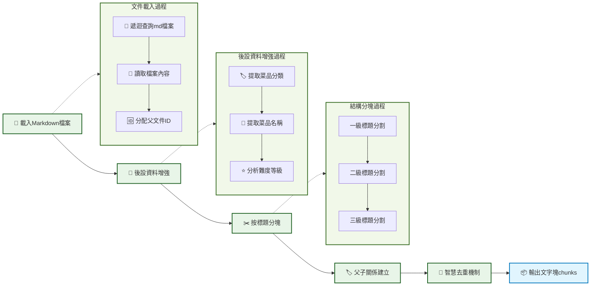

# 第二節 資料準備模組實現

RAG系統的效果很大程度上取決於資料準備的質量。在上一節中，我們明確了"小塊檢索，大塊生成"的父子文字塊策略。接下來學習如何將資料準備部分的架構思想轉化為可執行的程式碼。



## 一、核心設計

資料準備模組的核心是實現"小塊檢索，大塊生成"的父子文字塊架構。

**父子文字塊對映關係**：
```
父文件（完整菜譜）
├── 子塊1：菜品介紹 + 難度評級
├── 子塊2：必備原料和工具
├── 子塊3：計算（用量配比）
├── 子塊4：操作（製作步驟）
└── 子塊5：附加內容（變化做法）
```

**基本流程**：
- **檢索階段**：使用小的子塊進行精確匹配，提高檢索準確性
- **生成階段**：傳遞完整的父文件給LLM，確保上下文完整性
- **智慧去重**：當檢索到同一道菜的多個子塊時，合併為一個完整菜譜

**後設資料增強**：
- **菜品分類**：從檔案路徑推斷（葷菜、素菜、湯品等）
- **難度等級**：從內容中的星級標記提取
- **菜品名稱**：從檔名提取
- **文件關係**：建立父子文件的ID對映關係

## 二、模組實現詳解

> [data_preparation.py完整程式碼](https://github.com/datawhalechina/all-in-rag/blob/main/code/C8/rag_modules/data_preparation.py)

### 2.1 類結構設計

```python
class DataPreparationModule:
    """資料準備模組 - 負責資料載入、清洗和預處理"""

    def __init__(self, data_path: str):
        self.data_path = data_path
        self.documents: List[Document] = []  # 父文件（完整食譜）
        self.chunks: List[Document] = []     # 子文件（按標題分割的小塊）
        self.parent_child_map: Dict[str, str] = {}  # 子塊ID -> 父文件ID的對映
```

- `documents`: 儲存完整的菜譜文件（父文件）
- `chunks`: 儲存按標題分割的小塊（子文件）
- `parent_child_map`: 維護父子關係對映

### 2.2 文件載入實現

#### 2.2.1 批次載入Markdown檔案

```python
def load_documents(self) -> List[Document]:
    """載入文件資料"""
    documents = []
    data_path_obj = Path(self.data_path)

    for md_file in data_path_obj.rglob("*.md"):
        # 讀取檔案內容，保持Markdown格式
        with open(md_file, 'r', encoding='utf-8') as f:
            content = f.read()

        # 為每個父文件分配唯一ID
        parent_id = str(uuid.uuid4())

        # 建立Document物件
        doc = Document(
            page_content=content,
            metadata={
                "source": str(md_file),
                "parent_id": parent_id,
                "doc_type": "parent"  # 標記為父文件
            }
        )
        documents.append(doc)

    # 增強文件後設資料
    for doc in documents:
        self._enhance_metadata(doc)

    self.documents = documents
    return documents
```

- `rglob("*.md")`: 遞迴查詢所有Markdown檔案
- `parent_id`: 為每個父文件分配唯一ID，建立父子關係的關鍵
- `doc_type`: 標記為"parent"，便於區分父子文件

#### 2.2.2 後設資料增強

```python
def _enhance_metadata(self, doc: Document):
    """增強文件後設資料"""
    file_path = Path(doc.metadata.get('source', ''))
    path_parts = file_path.parts

    # 提取菜品分類
    category_mapping = {
        'meat_dish': '葷菜', 'vegetable_dish': '素菜', 'soup': '湯品',
        'dessert': '甜品', 'breakfast': '早餐', 'staple': '主食',
        'aquatic': '水產', 'condiment': '調料', 'drink': '飲品'
    }

    # 從檔案路徑推斷分類
    doc.metadata['category'] = '其他'
    for key, value in category_mapping.items():
        if key in file_path.parts:
            doc.metadata['category'] = value
            break

    # 提取菜品名稱
    doc.metadata['dish_name'] = file_path.stem

    # 分析難度等級
    content = doc.page_content
    if '★★★★★' in content:
        doc.metadata['difficulty'] = '非常困難'
    elif '★★★★' in content:
        doc.metadata['difficulty'] = '困難'
    # ... (其他難度等級判斷)

```

- **分類推斷**: 從HowToCook專案的目錄結構推斷菜品分類
- **難度提取**: 從內容中的星級標記自動提取難度等級
- **名稱提取**: 直接使用檔名作為菜品名稱

### 2.3 Markdown結構分塊

將完整的菜譜文件按照Markdown標題結構進行分塊，實現父子文字塊架構。

#### 2.3.1 分塊策略

```python
def chunk_documents(self) -> List[Document]:
    """Markdown結構感知分塊"""
    if not self.documents:
        raise ValueError("請先載入文件")

    # 使用Markdown標題分割器
    chunks = self._markdown_header_split()

    # 為每個chunk新增基礎後設資料
    for i, chunk in enumerate(chunks):
        if 'chunk_id' not in chunk.metadata:
            # 如果沒有chunk_id（比如分割失敗的情況），則生成一個
            chunk.metadata['chunk_id'] = str(uuid.uuid4())
        chunk.metadata['batch_index'] = i  # 在當前批次中的索引
        chunk.metadata['chunk_size'] = len(chunk.page_content)

    self.chunks = chunks
    return chunks
```

#### 2.3.2 Markdown標題分割器

```python
def _markdown_header_split(self) -> List[Document]:
    """使用Markdown標題分割器進行結構化分割"""
    # 定義要分割的標題層級
    headers_to_split_on = [
        ("#", "主標題"),      # 菜品名稱
        ("##", "二級標題"),   # 必備原料、計算、操作等
        ("###", "三級標題")   # 簡易版本、複雜版本等
    ]

    # 建立Markdown分割器
    markdown_splitter = MarkdownHeaderTextSplitter(
        headers_to_split_on=headers_to_split_on,
        strip_headers=False  # 保留標題，便於理解上下文
    )

    all_chunks = []
    for doc in self.documents:
        # 對每個文件進行Markdown分割
        md_chunks = markdown_splitter.split_text(doc.page_content)

        # 為每個子塊建立與父文件的關係
        parent_id = doc.metadata["parent_id"]

        for i, chunk in enumerate(md_chunks):
            # 為子塊分配唯一ID並建立父子關係
            child_id = str(uuid.uuid4())
            chunk.metadata.update(doc.metadata)
            chunk.metadata.update({
                "chunk_id": child_id,
                "parent_id": parent_id,
                "doc_type": "child",  # 標記為子文件
                "chunk_index": i      # 在父文件中的位置
            })

            # 建立父子對映關係
            self.parent_child_map[child_id] = parent_id

        all_chunks.extend(md_chunks)

    return all_chunks
```

- **三級標題分割**: 按照`#`、`##`、`###`進行層級分割
- **保留標題**: 設定`strip_headers=False`，保留標題資訊便於理解上下文
- **父子關係**: 每個子塊都記錄其父文件的`parent_id`
- **唯一標識**: 每個子塊都有獨立的`child_id`

#### 2.3.3 分塊效果示例

以"西紅柿炒雞蛋"為例，分塊後的效果：

```
原文件：西紅柿炒雞蛋的做法.md (父文件)
├── 子塊1：# 西紅柿炒雞蛋的做法 + 簡介 + 難度評級
├── 子塊2：## 必備原料和工具 + 食材清單
├── 子塊3：## 計算 + 用量配比公式
├── 子塊4：## 操作 + 詳細製作步驟
└── 子塊5：## 附加內容
```

**分塊邏輯**：
- **子塊1**: 包含一級標題及其下的所有內容（簡介、難度評級），直到遇到下一個二級標題
- **子塊2-5**: 每個二級標題及其下的內容形成一個獨立子塊
- **精確檢索**: 使用者問"需要什麼食材"時，能精確匹配到子塊2
- **上下文完整**: 生成時傳遞完整的父文件，包含所有必要資訊

### 2.4 智慧去重

當使用者詢問"宮保雞丁怎麼做"時，可能會檢索到同一道菜的多個子塊。我們需要智慧去重，避免重複資訊。

```python
def get_parent_documents(self, child_chunks: List[Document]) -> List[Document]:
    """根據子塊獲取對應的父文件（智慧去重）"""
    # 統計每個父文件被匹配的次數（相關性指標）
    parent_relevance = {}
    parent_docs_map = {}

    # 收集所有相關的父文件ID和相關性分數
    for chunk in child_chunks:
        parent_id = chunk.metadata.get("parent_id")
        if parent_id:
            # 增加相關性計數
            parent_relevance[parent_id] = parent_relevance.get(parent_id, 0) + 1

            # 快取父文件（避免重複查詢）
            if parent_id not in parent_docs_map:
                for doc in self.documents:
                    if doc.metadata.get("parent_id") == parent_id:
                        parent_docs_map[parent_id] = doc
                        break

    # 按相關性排序並構建去重後的父文件列表
    sorted_parent_ids = sorted(parent_relevance.keys(),
                             key=lambda x: parent_relevance[x], reverse=True)

    # 構建去重後的父文件列表
    parent_docs = []
    for parent_id in sorted_parent_ids:
        if parent_id in parent_docs_map:
            parent_docs.append(parent_docs_map[parent_id])

    return parent_docs
```

**去重邏輯**：
1. **統計相關性**: 計算每個父文件被匹配的子塊數量
2. **按相關性排序**: 匹配子塊越多的菜譜排名越靠前
3. **去重輸出**: 每個菜譜只輸出一次完整文件