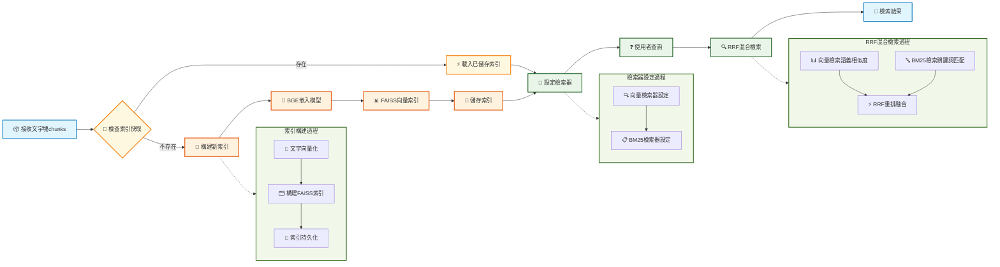

# 第三節 索引構建與檢索最佳化



## 一、核心設計

### 1.1 索引構建

索引構建模組的核心任務是將文字塊轉換為向量表示，並構建高效的檢索索引。這裡選擇之前一直使用的BGE-small-zh-v1.5作為嵌入模型，並使用FAISS作為向量資料庫來儲存和檢索向量。為了提升系統啟動速度，實現索引快取機制。首次構建後會將FAISS索引儲存到本地，後續啟動時直接載入已有索引，可以將啟動時間從幾分鐘縮短到幾秒鐘。

### 1.2 混合檢索

檢索最佳化模組實現了多種檢索策略的組合。採用雙路檢索的方式：向量檢索基於語義相似度，擅長理解查詢意圖；BM25檢索基於關鍵詞匹配，擅長精確匹配。為了綜合兩種檢索方式的優勢，我們使用RRF（Reciprocal Rank Fusion）演算法來融合檢索結果。這個演算法會綜合考慮兩種檢索結果的排名資訊，避免過度依賴單一檢索方式。

> RRF 可能並不是效果最好的重排方式，但是夠用🫠。如果想使用 ColBERT、RankLLM 等更先進的重排方法可以自行嘗試。

此外，系統還支援基於後設資料的智慧過濾，可以按菜品分類、難度等級等條件進行篩選檢索。

## 二、索引構建模組

> [index_construction.py完整程式碼](https://github.com/datawhalechina/all-in-rag/blob/main/code/C8/rag_modules/index_construction.py)

### 2.1 類結構設計

```python
class IndexConstructionModule:
    """索引構建模組 - 負責向量化和索引構建"""

    def __init__(self, model_name: str = "BAAI/bge-small-zh-v1.5",
                 index_save_path: str = "./vector_index"):
        self.model_name = model_name
        self.index_save_path = index_save_path
        self.embeddings = None
        self.vectorstore = None
        self.setup_embeddings()
```

- `index_save_path`: 索引儲存路徑
- `embeddings`: HuggingFace嵌入模型例項
- `vectorstore`: FAISS向量儲存例項


### 2.2 嵌入模型初始化

```python
def setup_embeddings(self):
    """初始化嵌入模型"""
    self.embeddings = HuggingFaceEmbeddings(
        model_name=self.model_name,
        model_kwargs={'device': 'cpu'},
        encode_kwargs={'normalize_embeddings': True}
    )
```

### 2.3 向量索引構建

```python
def build_vector_index(self, chunks: List[Document]) -> FAISS:
    """構建向量索引"""
    if not chunks:
        raise ValueError("文件塊列表不能為空")
    
    # 提取文字內容
    texts = [chunk.page_content for chunk in chunks]
    metadatas = [chunk.metadata for chunk in chunks]
    
    # 構建FAISS向量索引
    self.vectorstore = FAISS.from_texts(
        texts=texts,
        embedding=self.embeddings,
        metadatas=metadatas
    )
    
    return self.vectorstore
```

使用FAISS作為向量資料庫，它的檢索速度很快，同時儲存了文字內容和後設資料資訊，支援大規模向量的高效檢索。

### 2.4 索引快取機制

```python
def save_index(self):
    """儲存向量索引到配置的路徑"""
    if not self.vectorstore:
        raise ValueError("請先構建向量索引")
    
    # 確保儲存目錄存在
    Path(self.index_save_path).mkdir(parents=True, exist_ok=True)
    
    self.vectorstore.save_local(self.index_save_path)

def load_index(self):
    """從配置的路徑載入向量索引"""
    if not self.embeddings:
        self.setup_embeddings()
    
    if not Path(self.index_save_path).exists():
        return None
    
    self.vectorstore = FAISS.load_local(
        self.index_save_path, 
        self.embeddings,
        allow_dangerous_deserialization=True
    )
    return self.vectorstore
```

索引快取的效果很明顯：首次執行時構建索引需要幾分鐘，但後續執行時載入索引只需幾秒鐘。索引檔案通常只有幾十MB，儲存效率很高。

## 三、檢索最佳化模組

> [retrieval_optimization.py完整程式碼](https://github.com/datawhalechina/all-in-rag/blob/main/code/C8/rag_modules/retrieval_optimization.py)

### 3.1 類結構設計

```python
class RetrievalOptimizationModule:
    """檢索最佳化模組 - 負責混合檢索和過濾"""

    def __init__(self, vectorstore: FAISS, chunks: List[Document]):
        self.vectorstore = vectorstore
        self.chunks = chunks
        self.setup_retrievers()
```

- `vectorstore`: FAISS向量儲存例項
- `chunks`: 文件塊列表，用於BM25檢索

### 3.2 檢索器設定

```python
def setup_retrievers(self):
    """設定向量檢索器和BM25檢索器"""
    # 向量檢索器
    self.vector_retriever = self.vectorstore.as_retriever(
        search_type="similarity",
        search_kwargs={"k": 5}
    )

    # BM25檢索器
    self.bm25_retriever = BM25Retriever.from_documents(
        self.chunks,
        k=5
    )
```

### 3.3 RRF混合檢索

```python
def hybrid_search(self, query: str, top_k: int = 3) -> List[Document]:
    """混合檢索 - 結合向量檢索和BM25檢索，使用RRF重排"""
    # 分別獲取向量檢索和BM25檢索結果
    vector_docs = self.vector_retriever.get_relevant_documents(query)
    bm25_docs = self.bm25_retriever.get_relevant_documents(query)

    # 使用RRF重排
    reranked_docs = self._rrf_rerank(vector_docs, bm25_docs)
    return reranked_docs[:top_k]

def _rrf_rerank(self, vector_results: List[Document], bm25_results: List[Document]) -> List[Document]:
    """RRF (Reciprocal Rank Fusion) 重排"""
    
    # RRF融合演算法
    rrf_scores = {}
    k = 60  # RRF引數
    
    # 計算向量檢索的RRF分數
    for rank, doc in enumerate(vector_results):
        doc_id = id(doc)
        rrf_scores[doc_id] = rrf_scores.get(doc_id, 0) + 1 / (k + rank + 1)

    # 計算BM25檢索的RRF分數
    for rank, doc in enumerate(bm25_results):
        doc_id = id(doc)
        rrf_scores[doc_id] = rrf_scores.get(doc_id, 0) + 1 / (k + rank + 1)

    # 合併所有文件並按RRF分數排序
    all_docs = {id(doc): doc for doc in vector_results + bm25_results}
    sorted_docs = sorted(all_docs.items(),
                        key=lambda x: rrf_scores.get(x[0], 0),
                        reverse=True)

    return [doc for _, doc in sorted_docs]
```

在當前系統中，兩種檢索方式各有優勢：

**向量檢索的優勢**：
- 理解語義相似性，如"簡單易做的菜"能匹配到標記為"簡單"的菜譜
- 處理同義詞和近義詞，如"製作方法"和"做法"、"烹飪步驟"
- 理解使用者意圖，如"適合新手"能找到難度較低的菜譜

**BM25檢索的優勢**：
- 精確匹配菜名，如"宮保雞丁"能準確找到對應菜譜
- 匹配具體食材，如"土豆絲"、"西紅柿"等關鍵詞
- 處理專業術語，如"爆炒"、"紅燒"等烹飪手法

RRF演算法能綜合兩種檢索方式的排名資訊，既保證了語義理解的準確性，又確保了關鍵詞匹配的精確性。當然還可以用路由的方式，根據查詢型別智慧選擇使用向量檢索還是BM25檢索。這種方法針對性強，能為不同型別的查詢選擇最優的檢索方式；不足是路由規則的設計和維護比較複雜，邊界情況難以處理，而且通常需要呼叫LLM來判斷查詢型別，會增加延遲和成本。

### 3.4 後設資料過濾檢索

```python
def metadata_filtered_search(self, query: str, filters: Dict[str, Any],
                           top_k: int = 5) -> List[Document]:
    """基於後設資料過濾的檢索"""
    # 先進行向量檢索
    vector_retriever = self.vectorstore.as_retriever(
        search_type="similarity",
        search_kwargs={"k": top_k * 3, "filter": filters}  # 擴大檢索範圍
    )

    results = vector_retriever.invoke(query)
    return results[:top_k]
```

**過濾檢索應用場景**：
- 使用者詢問"推薦幾道素菜"時，可以按菜品分類過濾，只檢索素菜相關的內容
- 新手使用者問"有什麼簡單的菜譜"時，可以按難度等級過濾，只返回標記為"簡單"的菜譜
- 想做湯品時詢問"今天喝什麼湯"，可以按分類過濾出所有湯品菜譜
