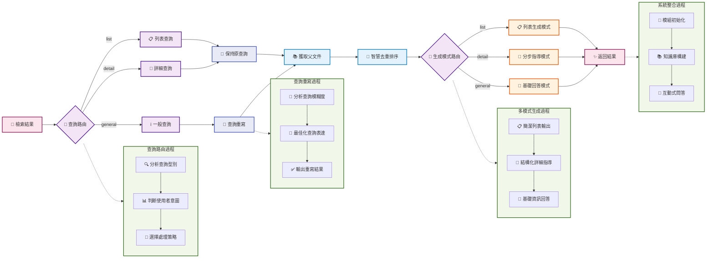

# 第四節 生成整合與系統整合

Boss要打完嘍！在最後一節來學習一下如何實現智慧的生成整合模組，以及將所有模組整合成一個完整的RAG系統。



## 一、生成整合模組

生成整合模組是整個RAG系統的"大腦"，負責理解使用者意圖、路由查詢型別，並生成高質量的回答。

> [generation_integration.py完整程式碼](https://github.com/datawhalechina/all-in-rag/blob/main/code/C8/rag_modules/generation_integration.py)

### 1.1 設計思路

**智慧查詢路由**：根據使用者查詢自動判斷是列表查詢、詳細查詢還是一般查詢，選擇最適合的生成策略。

**查詢重寫最佳化**：對模糊不清的查詢進行智慧重寫，提升檢索效果。比如將"做菜"重寫為"簡單易做的家常菜譜"。

**多模式生成**：
- **列表模式**：適用於推薦類查詢，返回簡潔的菜品列表
- **詳細模式**：適用於製作類查詢，提供分步驟的詳細指導
- **基礎模式**：適用於一般性問題，提供常規回答

> 上面說到的兩種主要方法可以回顧 [**查詢重構與分發**](https://github.com/datawhalechina/all-in-rag/blob/main/docs/chapter4/14_query_rewriting.md)

### 1.2 類結構設計

```python
class GenerationIntegrationModule:
    """生成整合模組 - 負責LLM整合和回答生成"""
    
    def __init__(self, model_name: str = "kimi-k2-0711-preview", 
                 temperature: float = 0.1, max_tokens: int = 2048):
        self.model_name = model_name
        self.temperature = temperature
        self.max_tokens = max_tokens
        self.llm = None
        self.setup_llm()
```

- `temperature`: 生成溫度，控制回答的創造性
- `max_tokens`: 最大生成長度
- `llm`: Moonshot Chat模型例項

### 1.3 查詢路由實現

```python
def query_router(self, query: str) -> str:
    """查詢路由 - 根據查詢型別選擇不同的處理方式"""
    prompt = ChatPromptTemplate.from_template("""
根據使用者的問題，將其分類為以下三種型別之一：

1. 'list' - 使用者想要獲取菜品列表或推薦，只需要菜名
   例如：推薦幾個素菜、有什麼川菜、給我3個簡單的菜

2. 'detail' - 使用者想要具體的製作方法或詳細資訊
   例如：宮保雞丁怎麼做、製作步驟、需要什麼食材

3. 'general' - 其他一般性問題
   例如：什麼是川菜、製作技巧、營養價值

請只返回分類結果：list、detail 或 general

使用者問題: {query}

分類結果:""")
    
    # ... (LCEL鏈式呼叫)
    return result
```

查詢路由是整個系統的關鍵，決定了後續的處理流程。透過LLM自動判斷查詢意圖，比簡單的關鍵詞匹配更準確。

### 1.4 查詢重寫最佳化

```python
def query_rewrite(self, query: str) -> str:
    """智慧查詢重寫 - 讓大模型判斷是否需要重寫查詢"""
    # 使用LLM分析查詢是否需要重寫
    # 具體明確的查詢（如"宮保雞丁怎麼做"）保持原樣
    # 模糊查詢（如"做菜"、"推薦個菜"）進行重寫最佳化

    # ... (提示詞設計和LCEL鏈式呼叫)
    return response
```

查詢重寫能夠將模糊的使用者輸入轉換為更適合檢索的查詢，顯著提升系統的實用性。重寫規則包括：保持原意不變、增加相關烹飪術語、優先推薦簡單易做的菜品。

### 1.5 多模式生成

**列表模式生成**：
```python
def generate_list_answer(self, query: str, context_docs: List[Document]) -> str:
    """生成列表式回答 - 適用於推薦類查詢"""
    # 提取菜品名稱
    dish_names = []
    for doc in context_docs:
        dish_name = doc.metadata.get('dish_name', '未知菜品')
        if dish_name not in dish_names:
            dish_names.append(dish_name)
    
    # 構建簡潔的列表回答
    if len(dish_names) <= 3:
        return f"為您推薦以下菜品：\n" + "\n".join([f"{i+1}. {name}" for i, name in enumerate(dish_names)])
    # ... (其他情況處理)
```

**詳細模式生成**：
```python
def generate_step_by_step_answer(self, query: str, context_docs: List[Document]) -> str:
    """生成分步驟回答"""
    # 使用結構化提示詞，包含：
    # - 🥘 菜品介紹
    # - 🛒 所需食材
    # - 👨‍🍳 製作步驟
    # - 💡 製作技巧

    # ... (提示詞設計和LCEL鏈式呼叫)
    return response
```

詳細模式使用結構化的提示詞設計，讓LLM能夠生成格式規範、內容豐富的分步驟指導，重點突出實用性和可操作性。

## 二、系統整合

主程式負責協調各個模組，實現完整的RAG流程：資料準備 → 索引構建 → 檢索最佳化 → 生成整合。同時提供了索引快取、互動式問答等實用功能。

> [main.py完整程式碼](https://github.com/datawhalechina/all-in-rag/blob/main/code/C8/main.py)

### 2.1 主系統類設計

```python
class RecipeRAGSystem:
    """食譜RAG系統主類"""
    
    def __init__(self, config: RAGConfig = None):
        self.config = config or DEFAULT_CONFIG
        self.data_module = None
        self.index_module = None
        self.retrieval_module = None
        self.generation_module = None
        
        # 檢查資料路徑和API金鑰
        if not Path(self.config.data_path).exists():
            raise FileNotFoundError(f"資料路徑不存在: {self.config.data_path}")
        if not os.getenv("MOONSHOT_API_KEY"):
            raise ValueError("請設定 MOONSHOT_API_KEY 環境變數")
```

主系統類負責協調所有模組，確保系統的完整性和一致性。

### 2.2 系統初始化流程

```python
def initialize_system(self):
    """初始化所有模組"""
    # 1. 初始化資料準備模組
    self.data_module = DataPreparationModule(self.config.data_path)
    
    # 2. 初始化索引構建模組
    self.index_module = IndexConstructionModule(
        model_name=self.config.embedding_model,
        index_save_path=self.config.index_save_path
    )
    
    # 3. 初始化生成整合模組
    self.generation_module = GenerationIntegrationModule(
        model_name=self.config.llm_model,
        temperature=self.config.temperature,
        max_tokens=self.config.max_tokens
    )
```

初始化過程按照依賴關係有序進行，保證每個模組都能正確設定。

### 2.3 知識庫構建流程

```python
def build_knowledge_base(self):
    """構建知識庫"""
    # 1. 嘗試載入已儲存的索引
    vectorstore = self.index_module.load_index()
    
    if vectorstore is not None:
        # 載入已有索引，但仍需要文件和分塊用於檢索模組
        self.data_module.load_documents()
        chunks = self.data_module.chunk_documents()
    else:
        # 構建新索引的完整流程
        self.data_module.load_documents()
        chunks = self.data_module.chunk_documents()
        vectorstore = self.index_module.build_vector_index(chunks)
        self.index_module.save_index()
    
    # 初始化檢索最佳化模組
    self.retrieval_module = RetrievalOptimizationModule(vectorstore, chunks)
```

這個流程運用了之前設計的索引快取機制，能夠大幅提升系統啟動速度。

### 2.4 智慧問答流程

```python
def ask_question(self, question: str, stream: bool = False):
    """回答使用者問題"""
    # 1. 查詢路由
    route_type = self.generation_module.query_router(question)

    # 2. 智慧查詢重寫（根據路由型別）
    if route_type == 'list':
        rewritten_query = question  # 列表查詢保持原樣
    else:
        rewritten_query = self.generation_module.query_rewrite(question)

    # 3. 檢索相關子塊
    relevant_chunks = self.retrieval_module.hybrid_search(rewritten_query, top_k=self.config.top_k)

    # 4. 根據路由型別選擇回答方式
    if route_type == 'list':
        # 列表查詢：返回菜品名稱列表
        relevant_docs = self.data_module.get_parent_documents(relevant_chunks)
        return self.generation_module.generate_list_answer(question, relevant_docs)
    else:
        # 詳細查詢：獲取完整文件並生成詳細回答
        relevant_docs = self.data_module.get_parent_documents(relevant_chunks)

        if route_type == "detail":
            # 詳細查詢使用分步指導模式
            return self.generation_module.generate_step_by_step_answer(question, relevant_docs)
        else:
            # 一般查詢使用基礎回答模式
            return self.generation_module.generate_basic_answer(question, relevant_docs)
```

這部分展示了程式執行流程：智慧路由 → 查詢最佳化 → 混合檢索 → 父子文件處理 → 多模式生成。

### 2.5 實際使用示例

#### 2.5.1 不同查詢型別的效果

**列表查詢示例**：
```
使用者問題: "推薦幾道簡單的素菜"
查詢型別: list
生成結果:
為您推薦以下菜品：
1. 西紅柿炒雞蛋
2. 土豆絲
3. 青椒炒豆腐
```

**詳細查詢示例**：
```
使用者問題: "宮保雞丁怎麼做？"
查詢型別: detail
生成結果:
## 🥘 菜品介紹
宮保雞丁是一道經典川菜，口感麻辣鮮香...

## 🛒 所需食材
- 雞胸肉 300g
- 花生米 100g
- 幹辣椒 10個
...

## 👨‍🍳 製作步驟
1. 雞肉切丁，用料酒和生抽醃製15分鐘
2. 熱鍋下油，爆炒花生米至微黃盛起
...
```

#### 2.5.2 互動式問答

系統提供了完整的命令列互動介面，啟動時會顯示"嚐嚐鹹淡RAG系統"的歡迎資訊：

```python
def run_interactive(self):
    """執行互動式問答"""
    print("=" * 60)
    print("🍽️  嚐嚐鹹淡RAG系統 - 互動式問答  🍽️")
    print("=" * 60)
    print("💡 解決您的選擇困難症，告別'今天吃什麼'的世紀難題！")

    # 初始化系統和構建知識庫
    self.initialize_system()
    self.build_knowledge_base()

    while True:
        user_input = input("\n您的問題: ").strip()
        if user_input.lower() in ['退出', 'quit', 'exit']:
            break

        # 詢問是否使用流式輸出
        stream_choice = input("是否使用流式輸出? (y/n, 預設y): ").strip().lower()
        use_stream = stream_choice != 'n'

        if use_stream:
            # 流式輸出，實時顯示生成過程
            for chunk in self.ask_question(user_input, stream=True):
                print(chunk, end="", flush=True)
        else:
            # 普通輸出
            answer = self.ask_question(user_input, stream=False)
            print(answer)
```

**執行效果示例**：
```
============================================================
🍽️  嚐嚐鹹淡RAG系統 - 互動式問答  🍽️
============================================================
💡 解決您的選擇困難症，告別'今天吃什麼'的世紀難題！

✅ 成功載入已儲存的向量索引！
✅ 系統初始化完成！

您的問題: 推薦幾道簡單的素菜
是否使用流式輸出? (y/n, 預設y): y

為您推薦以下素菜：
1. 西紅柿炒雞蛋 - 經典家常菜，簡單易做
2. 土豆絲 - 爽脆可口，適合新手
3. 青椒炒豆腐 - 營養豐富，製作簡單
```

流式輸出的實現透過LangChain的`chain.stream()`方法，它會返回一個生成器，每次yield一個文字片段。在互動式介面中，透過`print(chunk, end="", flush=True)`實時輸出每個片段，`end=""`避免換行，`flush=True`確保立即顯示，從而實現逐字逐句的流式效果。

## 三、最佳化方向

雖然當前系統已經具備了完整的RAG功能，但仍有許多最佳化空間。未來的最佳化可以聚焦於幾個關鍵方向的融合與深化：可以透過 **整合圖資料庫** 將食譜資料構建為知識圖譜，來揭示食材、菜品與烹飪方法間的複雜關聯，進而支援複雜關係查詢（如“和雞肉搭配的食材有哪些”）、發掘潛在的食材組合並實現基於圖的智慧推薦。還可以 **融合多模態資料**，結合菜品圖片等視覺資訊，利用多模態模型進行圖文聯合檢索，不僅能支援“這是什麼菜”的視覺搜尋，還可以透過影象識別食材來推薦相關菜譜。或者透過 **增強專業知識**，整合營養成分資料庫、烹飪技巧知識圖譜以及食材替換規則庫等外部知識源，系統將能提供精準的營養分析、專業的烹飪指導，並靈活適應使用者的飲食過敏或個人偏好。