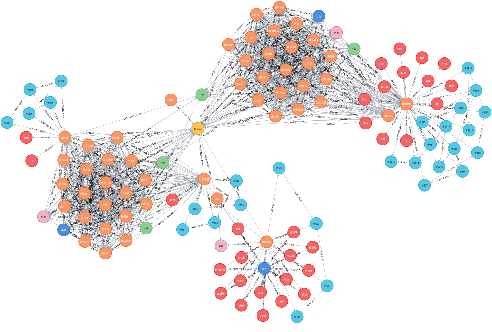

# 第一節 圖RAG系統架構與環境配置

> 在前面章節的基礎上，接下來構建一個更先進的圖RAG系統。透過引入Neo4j圖資料庫和智慧查詢路由機制，實現真正的知識圖譜增強檢索，解決傳統RAG在複雜查詢和關係推理方面的侷限性。



## 一、專案背景與目標

### 1.1 從傳統RAG到圖RAG的演進

上一章中，我們構建了基於向量檢索的傳統RAG系統，採用了父子文字塊的分塊策略，能夠有效回答簡單的菜譜查詢。但在處理複雜的關係推理和多跳查詢時仍存在明顯侷限：

- **關係理解缺失**：雖然父子分塊保持了文件結構，但無法顯式建模食材、菜譜、烹飪方法之間的語義關係
- **跨文件關聯困難**：難以發現不同菜譜之間的相似性、替代關係等隱含聯絡
- **推理能力有限**：缺乏基於知識圖譜的多跳推理能力，難以回答需要複雜邏輯推理的問題

### 1.2 圖RAG系統的核心優勢

透過引入知識圖譜，我們的新系統將具備：

- **結構化知識表達**：以圖的形式顯式編碼實體間的語義關係
- **增強推理能力**：支援多跳推理和複雜關係查詢
- **智慧查詢路由**：根據查詢複雜度自動選擇最適合的檢索策略
- **事實性與可解釋性**：基於圖結構的推理路徑提供可追溯的答案

## 二、環境配置

> 若需要進行外部訪問，需更換本地或伺服器環境

### 2.1 建立虛擬環境

```bash
# 使用conda建立環境
conda create -n graph-rag python=3.12.7
conda activate graph-rag
```

### 2.2 安裝核心依賴

```bash
cd code/C9
pip install -r requirements.txt
```

### 2.3 Neo4j資料庫配置

使用Docker Compose方式安裝Neo4j，配置檔案位於 [`data/C9/docker-compose.yml`](https://github.com/datawhalechina/all-in-rag/blob/main/data/C9/docker-compose.yml)：

#### 2.3.1 啟動Neo4j服務

```bash
# 進入docker-compose.yml所在目錄
cd data/C9

# 啟動Neo4j服務
docker-compose up -d

# 檢查服務狀態
docker-compose ps
```

#### 2.3.2 訪問Neo4j Web介面

啟動成功後，可以透過以下方式訪問：
- **Web介面**：http://localhost:7474
- **使用者名稱**：neo4j
- **密碼**：all-in-rag

> 當前網址為本地訪問，如果你是部署在遠端伺服器上，需要將 `localhost` 修改為你的伺服器IP地址。

#### 2.3.3 資料匯入

Docker Compose配置中包含了自動資料匯入功能。啟動服務時會自動執行以下步驟：

1. **等待Neo4j服務就緒**：透過健康檢查確保資料庫可用
2. **執行匯入指令碼**：自動執行 `data/C9/cypher/neo4j_import.cypher`
3. **匯入菜譜資料**：包括菜譜、食材、烹飪步驟等節點和關係

匯入的資料包括：
- **菜譜節點**：包含菜名、難度、烹飪時間、菜系等資訊
- **食材節點**：包含食材名稱、分類、營養資訊等
- **烹飪步驟節點**：包含步驟描述、烹飪方法、所需工具等
- **關係網路**：菜譜與食材、步驟之間的複雜關係

如果需要手動重新匯入資料：

```bash
# 進入容器執行匯入指令碼
docker exec -it neo4j-db cypher-shell -u neo4j -p all-in-rag -f /import/cypher/neo4j_import.cypher
```

### 2.4 Milvus向量資料庫配置

#### 2.4.1 使用Docker安裝Milvus

> 如果前面已經安裝過了可以跳過此步，透過 `docker-compose ps` 確認Milvus服務正在執行即可。

```bash
# 下載Milvus standalone配置檔案
wget https://github.com/milvus-io/milvus/releases/download/v2.5.11/milvus-standalone-docker-compose.yml -O docker-compose.yml

# 啟動Milvus
docker-compose up -d
```

#### 2.4.2 驗證安裝

```bash
# 檢查Milvus服務狀態
docker-compose ps
```

### 2.5 配置連線引數

在專案根目錄建立 `.env` 檔案：

```env
# Neo4j配置
NEO4J_URI=bolt://localhost:7687
NEO4J_USER=neo4j
NEO4J_PASSWORD=all-in-rag
NEO4J_DATABASE=neo4j

# Milvus配置
MILVUS_HOST=localhost
MILVUS_PORT=19530

# LLM API配置
MOONSHOT_API_KEY=your_api_key_here
```

## 三、系統架構設計

### 3.1 整體架構

我們的圖RAG系統採用模組化設計，包含以下核心元件：

```mermaid
flowchart TD
    %% 系統啟動和初始化
    START["🚀 啟動高階圖RAG系統"] --> CONFIG["⚙️ 載入配置<br/>GraphRAGConfig"]
    CONFIG --> INIT_CHECK{"🔍 檢查系統依賴"}
    
    %% 依賴檢查
    INIT_CHECK -->|Neo4j連線失敗| NEO4J_ERROR["❌ Neo4j連線錯誤<br/>檢查圖資料庫狀態"]
    INIT_CHECK -->|Milvus連線失敗| MILVUS_ERROR["❌ Milvus連線錯誤<br/>檢查向量資料庫"]
    INIT_CHECK -->|LLM API失敗| LLM_ERROR["❌ LLM API錯誤<br/>檢查API金鑰"]
    INIT_CHECK -->|依賴正常| INIT_MODULES["✅ 初始化核心模組"]
    
    %% 知識庫狀態檢查
    INIT_MODULES --> KB_CHECK{"📚 檢查知識庫狀態"}
    KB_CHECK -->|Milvus集合存在| LOAD_KB["⚡ 載入已存在知識庫"]
    KB_CHECK -->|集合不存在| BUILD_KB["🔨 構建新知識庫"]
    
    %% 載入已有知識庫
    LOAD_KB --> LOAD_SUCCESS{"載入成功？"}
    LOAD_SUCCESS -->|成功| SYSTEM_READY["✅ 系統就緒<br/>顯示統計資訊"]
    LOAD_SUCCESS -->|失敗| REBUILD_KB["🔄 重建知識庫"]
    
    %% 構建新知識庫流程
    BUILD_KB --> NEO4J_LOAD["🔗 從Neo4j載入圖資料<br/>菜譜、食材、烹飪步驟節點"]
    REBUILD_KB --> NEO4J_LOAD
    NEO4J_LOAD --> BUILD_DOCS["📝 構建結構化菜譜文件<br/>組合圖資料為完整文件"]
    BUILD_DOCS --> CHUNK_DOCS["✂️ 智慧文件分塊<br/>按章節或長度分塊"]
    CHUNK_DOCS --> BUILD_VECTOR["🎯 構建Milvus向量索引"]
    BUILD_VECTOR --> SYSTEM_READY
    
    %% 使用者互動迴圈
    SYSTEM_READY --> USER_INPUT["👤 使用者輸入查詢"]
    USER_INPUT --> SPECIAL_CMD{"🔍 特殊命令檢查"}
    
    %% 特殊命令處理
    SPECIAL_CMD -->|stats| STATS["📊 顯示系統統計<br/>路由統計、知識庫狀態"]
    SPECIAL_CMD -->|rebuild| REBUILD_CMD["🔄 重建知識庫命令"]
    SPECIAL_CMD -->|quit| EXIT["👋 退出系統"]
    
    %% 普通查詢處理 - 智慧路由核心
    SPECIAL_CMD -->|普通查詢| QUERY_ANALYSIS["🧠 深度查詢分析"]
    
    %% 查詢分析的四個維度
    QUERY_ANALYSIS --> COMPLEXITY_ANALYSIS["📊 複雜度分析<br/>0.0-0.3: 簡單查詢<br/>0.4-0.7: 中等複雜<br/>0.8-1.0: 高複雜推理"]
    QUERY_ANALYSIS --> RELATION_ANALYSIS["🔗 關係密集度分析<br/>0.0-0.3: 單一實體<br/>0.4-0.7: 實體關係<br/>0.8-1.0: 複雜關係網路"]
    QUERY_ANALYSIS --> REASONING_ANALYSIS["🤔 推理需求判斷<br/>多跳推理？因果分析？<br/>對比分析？"]
    QUERY_ANALYSIS --> ENTITY_ANALYSIS["🏷️ 實體識別統計<br/>實體數量和型別"]
    
    %% LLM智慧分析
    COMPLEXITY_ANALYSIS --> LLM_ANALYSIS["🤖 LLM智慧分析<br/>綜合評估查詢特徵"]
    RELATION_ANALYSIS --> LLM_ANALYSIS
    REASONING_ANALYSIS --> LLM_ANALYSIS
    ENTITY_ANALYSIS --> LLM_ANALYSIS
    
    %% 分析結果和降級處理
    LLM_ANALYSIS --> ANALYSIS_SUCCESS{"分析成功？"}
    ANALYSIS_SUCCESS -->|成功| ROUTE_DECISION["🎯 智慧路由決策"]
    ANALYSIS_SUCCESS -->|失敗| RULE_FALLBACK["📋 降級到規則分析<br/>基於關鍵詞匹配"]
    RULE_FALLBACK --> ROUTE_DECISION
    
    %% 三種檢索策略路由
    ROUTE_DECISION -->|簡單查詢<br/>複雜度<0.4| HYBRID_SEARCH["🔍 傳統混合檢索<br/>保底策略"]
    ROUTE_DECISION -->|複雜推理<br/>關係密集>0.7| GRAPH_RAG_SEARCH["🕸️ 圖RAG檢索<br/>高階複雜策略"]
    ROUTE_DECISION -->|中等複雜<br/>需要組合| COMBINED_SEARCH["🔄 組合檢索策略<br/>融合兩種方法"]
    
    %% 檢索執行和錯誤處理
    HYBRID_SEARCH --> HYBRID_SUCCESS{"檢索成功？"}
    GRAPH_RAG_SEARCH --> GRAPH_SUCCESS{"檢索成功？"}
    COMBINED_SEARCH --> COMBINED_SUCCESS{"檢索成功？"}
    
    %% 高階策略失敗時降級到傳統混合檢索
    GRAPH_SUCCESS -->|失敗| FALLBACK_TO_HYBRID["⬇️ 降級到傳統混合檢索<br/>保底方案"]
    COMBINED_SUCCESS -->|失敗| FALLBACK_TO_HYBRID
    
    %% 傳統混合檢索失敗時直接異常
    HYBRID_SUCCESS -->|失敗| SYSTEM_ERROR["❌ 系統檢索異常<br/>傳統混合檢索失敗<br/>無更低階降級"]
    FALLBACK_TO_HYBRID --> FALLBACK_SUCCESS{"降級檢索成功？"}
    FALLBACK_SUCCESS -->|失敗| SYSTEM_ERROR
    
    %% 成功路徑
    HYBRID_SUCCESS -->|成功| GENERATE["🎨 生成回答"]
    GRAPH_SUCCESS -->|成功| GENERATE
    COMBINED_SUCCESS -->|成功| GENERATE
    FALLBACK_SUCCESS -->|成功| GENERATE
    
    %% 固定的流式輸出
    GENERATE --> STREAM_OUTPUT["📺 流式輸出回答<br/>use_stream = True<br/>逐字元實時顯示"]
    
    %% 統計更新和迴圈
    STREAM_OUTPUT --> UPDATE_STATS["📈 更新路由統計"]
    UPDATE_STATS --> USER_INPUT
    
    %% 特殊命令返回迴圈
    STATS --> USER_INPUT
    REBUILD_CMD --> BUILD_KB
    
    %% 錯誤處理返回
    NEO4J_ERROR --> EXIT
    MILVUS_ERROR --> EXIT
    LLM_ERROR --> EXIT
    SYSTEM_ERROR --> USER_INPUT
    
    %% 詳細子流程
    subgraph DataFlow ["📊 圖資料處理流程"]
        NEO4J_DB["🗄️ Neo4j圖資料庫<br/>儲存菜譜、食材、烹飪步驟<br/>以及它們之間的關係網路"]
        RECIPE_BUILD["📝 結構化菜譜文件構建<br/>菜譜名稱 + 分類 + 難度<br/>+ 食材列表 + 製作步驟<br/>+ 時間資訊 + 標籤"]
        DOC_CHUNK["✂️ 智慧文件分塊<br/>按章節分塊：## 所需食材、## 製作步驟<br/>或按長度分塊：chunk_size=500<br/>重疊處理：chunk_overlap=50"]
        MILVUS_INDEX["🎯 Milvus向量索引<br/>BGE-small-zh-v1.5<br/>512維向量空間"]
        
        NEO4J_DB --> RECIPE_BUILD
        RECIPE_BUILD --> DOC_CHUNK
        DOC_CHUNK --> MILVUS_INDEX
    end

    subgraph HybridFlow ["🔍 傳統混合檢索流程（保底）"]
        DUAL_RETRIEVAL["🎯 雙層檢索<br/>實體級+主題級"]
        VECTOR_SEARCH["📊 增強向量檢索<br/>語義相似度匹配"]
        BM25_SEARCH["🔤 BM25關鍵詞檢索<br/>jieba分詞+停用詞過濾"]
        RRF_MERGE["⚖️ RRF融合<br/>Reciprocal Rank Fusion<br/>三路排名加權求和"]
        PARENT_DOC["📄 父文件回填（可選）<br/>chunk→整篇父菜譜<br/>保證上下文完整性"]
        INTERNAL_FALLBACK["🔧 內部降級機制<br/>關鍵詞提取失敗→簡單分詞<br/>圖索引不足→Neo4j補充<br/>Neo4j失敗→靜默失敗"]
        
        DUAL_RETRIEVAL --> RRF_MERGE
        VECTOR_SEARCH --> RRF_MERGE
        BM25_SEARCH --> RRF_MERGE
        INTERNAL_FALLBACK --> RRF_MERGE
        RRF_MERGE --> PARENT_DOC
    end
    
    subgraph GraphRAGFlow ["🕸️ 圖RAG檢索流程（高階複雜）"]
        GRAPH_UNDERSTAND["🧠 圖查詢理解<br/>entity_relation/multi_hop<br/>subgraph/path_finding"]
        MULTI_HOP["🔄 多跳圖遍歷<br/>最大深度3跳<br/>發現隱含關聯"]
        SUBGRAPH_EXTRACT["🕸️ 知識子圖提取<br/>完整知識網路<br/>最大100節點"]
        GRAPH_REASONING["🤔 圖結構推理<br/>推理鏈構建<br/>可信度驗證"]
        
        GRAPH_UNDERSTAND --> MULTI_HOP
        GRAPH_UNDERSTAND --> SUBGRAPH_EXTRACT
        MULTI_HOP --> GRAPH_REASONING
        SUBGRAPH_EXTRACT --> GRAPH_REASONING
    end
    
    subgraph CombinedFlow ["🔄 組合檢索流程"]
        SPLIT_QUOTA["📊 分配檢索配額<br/>traditional_k = top_k // 2<br/>graph_k = top_k - traditional_k"]
        PARALLEL_SEARCH["⚡ 並行執行檢索<br/>傳統檢索 + 圖RAG檢索"]
        ROUND_ROBIN["🔄 Round-robin合併<br/>交替新增結果<br/>圖RAG優先"]
        DEDUP["🧹 去重和排序<br/>基於內容雜湊"]
        
        SPLIT_QUOTA --> PARALLEL_SEARCH
        PARALLEL_SEARCH --> ROUND_ROBIN
        ROUND_ROBIN --> DEDUP
    end
    
    subgraph FallbackStrategy ["⬇️ 降級策略（有限降級）"]
        LEVEL3["🕸️ 圖RAG檢索<br/>最高階：多跳推理+子圖提取"]
        LEVEL2["🔄 組合檢索<br/>中級：融合兩種方法"]
        LEVEL1["🔍 傳統混合檢索<br/>保底：無更低階降級"]
        ERROR_LEVEL["❌ 系統異常<br/>傳統混合檢索失敗"]
        
        LEVEL3 -->|失敗| LEVEL1
        LEVEL2 -->|失敗| LEVEL1
        LEVEL1 -->|失敗| ERROR_LEVEL
    end
    
    %% 樣式定義
    classDef startup fill:#e3f2fd,stroke:#0277bd,stroke-width:2px
    classDef config fill:#f1f8e9,stroke:#388e3c,stroke-width:2px
    classDef basic fill:#fff3e0,stroke:#f57c00,stroke-width:2px
    classDef advanced fill:#e8eaf6,stroke:#3f51b5,stroke-width:2px
    classDef knowledge fill:#e8f5e8,stroke:#1b5e20,stroke-width:2px
    classDef analysis fill:#f3e5f5,stroke:#4a148c,stroke-width:2px
    classDef routing fill:#e1f5fe,stroke:#01579b,stroke-width:2px
    classDef generation fill:#fce4ec,stroke:#880e4f,stroke-width:2px
    classDef userflow fill:#fff8e1,stroke:#f57c00,stroke-width:2px
    classDef error fill:#ffebee,stroke:#c62828,stroke-width:2px
    classDef success fill:#e8f5e8,stroke:#2e7d32,stroke-width:2px
    classDef fallback fill:#fff3e0,stroke:#ff6f00,stroke-width:2px
    classDef stream fill:#e1f5fe,stroke:#0288d1,stroke-width:2px
    classDef combined fill:#f3e5f5,stroke:#7b1fa2,stroke-width:2px
    classDef graphdata fill:#e8f5e8,stroke:#2e7d32,stroke-width:2px
    
    %% 應用樣式
    class START,INIT_MODULES,SYSTEM_READY startup
    class CONFIG config
    class HYBRID_SEARCH,HybridFlow,LEVEL1 basic
    class GRAPH_RAG_SEARCH,GraphRAGFlow,LEVEL3 advanced
    class KB_CHECK,LOAD_KB,BUILD_KB,NEO4J_LOAD,BUILD_DOCS,CHUNK_DOCS,BUILD_VECTOR knowledge
    class QUERY_ANALYSIS,COMPLEXITY_ANALYSIS,RELATION_ANALYSIS,REASONING_ANALYSIS,ENTITY_ANALYSIS,LLM_ANALYSIS analysis
    class ROUTE_DECISION,ANALYSIS_SUCCESS,RULE_FALLBACK routing
    class GENERATE generation
    class USER_INPUT,SPECIAL_CMD,STATS,REBUILD_CMD,EXIT userflow
    class NEO4J_ERROR,MILVUS_ERROR,LLM_ERROR,SYSTEM_ERROR,ERROR_LEVEL error
    class LOAD_SUCCESS,INIT_CHECK,HYBRID_SUCCESS,GRAPH_SUCCESS,COMBINED_SUCCESS,FALLBACK_SUCCESS success
    class FALLBACK_TO_HYBRID,FallbackStrategy fallback
    class STREAM_OUTPUT,UPDATE_STATS stream
    class COMBINED_SEARCH,CombinedFlow,LEVEL2 combined
    class DataFlow,NEO4J_DB graphdata
```



### 3.2 核心模組說明

#### 圖資料準備模組 (GraphDataPreparationModule)
- **功能**：連線Neo4j資料庫，載入圖資料，構建結構化菜譜文件
- **特點**：支援圖資料到文件的智慧轉換，保持知識結構完整性

#### 向量索引模組 (MilvusIndexConstructionModule)  
- **功能**：構建和管理Milvus向量索引，支援語義相似度檢索
- **特點**：使用BGE-small-zh-v1.5模型，512維向量空間

#### 混合檢索模組 (HybridRetrievalModule)
- **功能**：傳統的混合檢索策略，三路召回（雙層檢索+向量檢索+BM25）經 RRF 融合
- **特點**：雙層檢索（實體級+主題級），BM25關鍵詞檢索（jieba分詞），RRF排名融合，可選父文件回填

#### 圖RAG檢索模組 (GraphRAGRetrieval)
- **功能**：基於圖結構的高階檢索，支援多跳推理和子圖提取
- **特點**：圖查詢理解、多跳遍歷、知識子圖提取

#### 智慧查詢路由 (IntelligentQueryRouter)
- **功能**：分析查詢特徵，自動選擇最適合的檢索策略
- **特點**：LLM驅動的查詢分析，動態策略選擇

#### 生成整合模組 (GenerationIntegrationModule)
- **功能**：基於檢索結果生成最終答案，支援流式輸出
- **特點**：自適應生成策略，錯誤處理與重試機制

### 3.3 資料流程

1. **資料準備階段**：
   - 從Neo4j載入圖資料（菜譜、食材、步驟節點及其關係）
   - 構建結構化菜譜文件，保持知識完整性
   - 進行智慧文件分塊，支援章節和長度雙重分塊策略
   - 構建Milvus向量索引，支援語義檢索

2. **查詢處理階段**：
   - 使用者輸入查詢
   - 智慧查詢路由器分析查詢特徵（複雜度、關係密集度、推理需求）
   - 根據分析結果選擇檢索策略：
     - 簡單查詢 → 傳統混合檢索
     - 複雜推理 → 圖RAG檢索  
     - 中等複雜 → 組合檢索策略
   - 執行相應的檢索操作
   - 生成模組基於檢索結果生成答案

3. **錯誤處理與降級**：
   - 高階策略失敗時自動降級到傳統混合檢索
   - 傳統混合檢索失敗時返回系統異常
   - 支援流式輸出中斷時的自動重試機制

## 四、專案檔案結構

```
code/C9/
├── main.py                          # 主程式入口
├── config.py                        # 配置檔案
├── requirements.txt                 # 依賴包列表
└── rag_modules/                     # RAG模組包
    ├── __init__.py
    ├── graph_data_preparation.py    # 圖資料準備模組
    ├── milvus_index_construction.py # Milvus索引構建模組
    ├── hybrid_retrieval.py          # 混合檢索模組
    ├── graph_rag_retrieval.py       # 圖RAG檢索模組
    ├── intelligent_query_router.py  # 智慧查詢路由器
    └── generation_integration.py    # 生成整合模組
```

## 五、快速開始

### 5.1 啟動系統

```bash
# 確保Neo4j和Milvus服務已啟動
python main.py
```

### 5.2 系統初始化

首次執行時，系統會自動：
1. 檢查並連線Neo4j和Milvus資料庫
2. 載入圖資料並構建菜譜文件
3. 建立向量索引
4. 初始化各個檢索模組
5. 顯示系統統計資訊

### 5.3 互動式問答

系統啟動後，可以進行互動式問答：

```
您的問題: 川菜有哪些特色菜？
您的問題: 如何製作宮保雞丁？
您的問題: 減肥期間適合吃什麼菜？
您的問題: stats  # 檢視系統統計
您的問題: quit   # 退出系統
```
