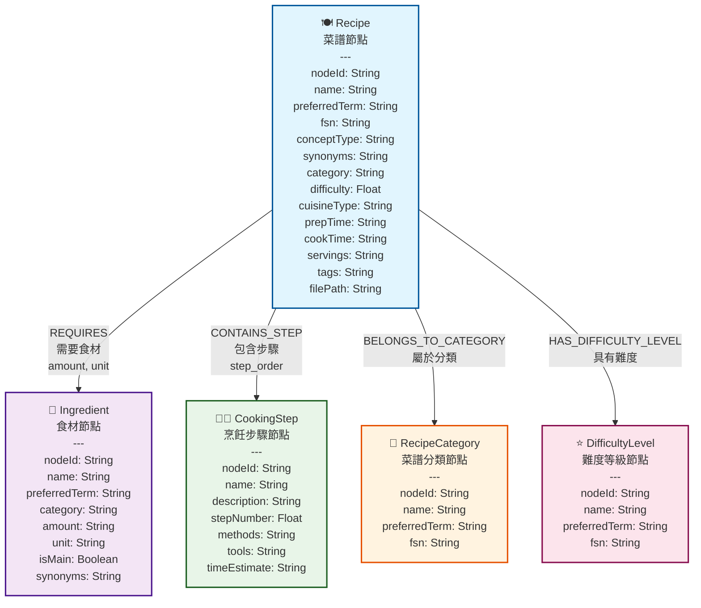
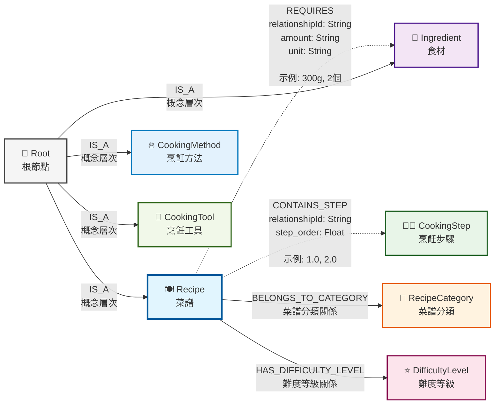

# 第二節 圖資料建模與Neo4j整合

> [本節完整程式碼](https://github.com/datawhalechina/all-in-rag/blob/main/code/C9/rag_modules/graph_data_preparation.py)

## 一、資料來源與轉換

### 1.1 從Markdown到圖資料的轉換

本章的圖資料來源於第八章中使用的Markdown格式菜譜資料。為了構建知識圖譜，筆者用AI開發了一個簡單的[Agent](https://github.com/datawhalechina/all-in-rag/tree/main/code/C9/agent(%E4%BB%A3%E7%A0%81%E7%B3%BBai%E7%94%9F%E6%88%90))，透過LLM將結構化的Markdown菜譜資料轉換為CSV格式的圖資料。

**轉換流程**：
1. **讀取Markdown菜譜**：從第八章的資料來源載入菜譜檔案
2. **LLM解析提取**：使用大語言模型識別和提取實體及關係
3. **結構化輸出**：生成nodes.csv和relationships.csv檔案
4. **圖資料匯入**：透過Cypher指令碼匯入Neo4j資料庫

### 1.2 圖資料檔案結構

轉換後的圖資料包含兩個核心檔案：

```
data/C9/cypher/
├── nodes.csv          # 節點資料（菜譜、食材、步驟等）
├── relationships.csv  # 關係資料（菜譜-食材、菜譜-步驟等）
└── neo4j_import.cypher # 資料匯入指令碼
```

## 二、圖資料模型設計

### 2.1 實際資料結構分析

基於LLM轉換後的實際圖資料，知識圖譜包含以下核心實體型別。如果你有遊戲逆向經驗，可以把這些實體型別想象成虛幻引擎烹飪遊戲中的物件類，節點間的關係就像物件間的指標引用：

**核心實體型別**：
- **Recipe (菜譜)**：具體的菜品，包含難度、菜系、時間等屬性
- **Ingredient (食材)**：製作菜品所需的原料，包含分類、用量、單位等
- **CookingStep (烹飪步驟)**：詳細的製作步驟，包含方法、工具、時間估計
- **CookingMethod (烹飪方法)**：如炒、煮、蒸、炸等烹飪技法
- **CookingTool (烹飪工具)**：如炒鍋、蒸鍋、刀具等
- **DifficultyLevel (難度等級)**：一星到五星的難度分級
- **RecipeCategory (菜譜分類)**：素菜、葷菜、水產、早餐等分類

**實際資料特點**：
- **統一編碼體系**：使用nodeId進行唯一標識（如201000001）
- **多語言支援**：包含preferredTerm、fsn等多語言欄位
- **豐富屬性**：每個實體包含詳細的屬性資訊
- **層次化結構**：從抽象概念到具體例項的層次化組織

### 2.2 實際節點模型

基於實際資料的圖資料模型：



**節點型別說明**：

- **🍽️ Recipe (菜譜節點)**: 核心實體，包含菜譜的完整資訊
- **🥬 Ingredient (食材節點)**: 製作菜譜所需的食材資訊
- **👨‍🍳 CookingStep (烹飪步驟節點)**: 詳細的製作步驟和方法
- **📂 RecipeCategory (菜譜分類節點)**: 菜品分類（素菜、葷菜、水產等）
- **⭐ DifficultyLevel (難度等級節點)**: 製作難度分級（一星到五星）

### 2.3 實際關係模型

基於實際資料的關係結構：



**關係型別說明**：

| 關係編碼 | 關係型別 | 說明 | 屬性 |
|---------|---------|------|------|
| **801000001** | REQUIRES | 菜譜-食材關係 | relationshipId, amount, unit |
| **801000003** | CONTAINS_STEP | 菜譜-步驟關係 | relationshipId, step_order |
| **801000004** | HAS_DIFFICULTY_LEVEL | 菜譜-難度關係 | relationshipId |
| **801000005** | BELONGS_TO_CATEGORY | 菜譜-分類關係 | relationshipId |

**關係特點**：
- **虛線箭頭**：表示帶有豐富屬性的關係（如REQUIRES、CONTAINS_STEP）
- **實線箭頭**：表示簡單的分類關係
- **層次化結構**：Root節點作為概念層次的頂層節點

## 三、Neo4j資料匯入

### 3.1 資料準備指令碼

系統透過 `GraphDataPreparationModule` 來處理圖資料的載入和管理：

```python
class GraphDataPreparationModule:
    def __init__(self, neo4j_config: dict):
        """
        初始化圖資料準備模組
        
        Args:
            neo4j_config: Neo4j連線配置
        """
        self.driver = GraphDatabase.driver(
            neo4j_config['uri'],
            auth=(neo4j_config['user'], neo4j_config['password'])
        )
        
    def load_graph_data(self) -> List[Dict]:
        """
        從Neo4j載入圖資料
        
        Returns:
            包含菜譜資訊的字典列表
        """
        query = """
        MATCH (r:Recipe)
        OPTIONAL MATCH (r)-[:REQUIRES]->(i:Ingredient)
        OPTIONAL MATCH (r)-[:HAS_STEP]->(s:Step)
        OPTIONAL MATCH (r)-[:BELONGS_TO]->(c:Category)
        RETURN r, collect(DISTINCT i) as ingredients, 
               collect(DISTINCT s) as steps,
               collect(DISTINCT c) as categories
        ORDER BY r.name
        """
        
        with self.driver.session() as session:
            result = session.run(query)
            return [record for record in result]
```

### 3.2 實際CSV資料格式

轉換後的CSV檔案格式（基於實際資料）：

**nodes.csv結構**：
```csv
nodeId,labels,name,preferredTerm,fsn,conceptType,synonyms,category,difficulty,cuisineType,prepTime,cookTime,servings,tags,filePath,amount,unit,isMain,description,stepNumber,methods,tools,timeEstimate
```

**實際資料示例**：
```csv
201000184,Recipe,幹煎阿根廷紅蝦,幹煎阿根廷紅蝦,,Recipe,"[{'term': '幹pan-fried阿根廷紅蝦', 'language': 'zh'}]",水產,3.0,,提前1天冷藏解凍+10分鐘,約5分鐘,1人,"趁熱吃,檸檬可增酸提味",dishes\aquatic\幹煎阿根廷紅蝦\幹煎阿根廷紅蝦.md,,,,,,,,
201000185,Ingredient,阿根廷紅蝦,阿根廷紅蝦,,Ingredient,,蛋白質,,,,,,,,2-3,只,True,,,,,
201000196,CookingStep,步驟1,步驟1,,CookingStep,,,,,,,,,,,,,阿根廷紅蝦提前1天從速凍取出放到冷藏裡自然解凍,1.0,解凍,冰箱,24小時
```

**relationships.csv結構**：
```csv
startNodeId,endNodeId,relationshipType,relationshipId,amount,unit,step_order
```

**實際關係示例**：
```csv
201000184,201000185,801000001,R_000001,2-3,只,
201000184,201000196,801000003,R_000010,,,1.0
201000184,720000000,801000002,R_000020,,,
```

## 四、圖資料查詢與檢索

### 4.1 基礎查詢模式

#### 簡單實體查詢
```cypher
// 查詢所有水產類菜譜
MATCH (r:Recipe)
WHERE r.category = "水產"
RETURN r.name, r.difficulty, r.prepTime, r.cookTime

// 查詢包含特定食材的菜譜
MATCH (r:Recipe)-[:REQUIRES]->(i:Ingredient)
WHERE i.name CONTAINS "蝦"
RETURN r.name, r.difficulty, i.name, i.amount, i.unit

// 使用全文搜尋查詢菜譜
CALL db.index.fulltext.queryNodes("recipe_fulltext_index", "川菜 OR 辣椒")
YIELD node, score
RETURN node.name, node.category, score
ORDER BY score DESC
```

#### 多跳關係查詢
```cypher
// 查詢某個難度等級的所有菜譜（基於屬性查詢）
MATCH (r:Recipe)
WHERE r.difficulty = 3.0
RETURN r.name, r.category, r.prepTime, r.cookTime, r.difficulty

// 查詢菜譜的完整製作流程
MATCH (r:Recipe {name: "幹煎阿根廷紅蝦"})-[:CONTAINS_STEP]->(s:CookingStep)
RETURN r.name, s.stepNumber, s.description, s.methods, s.tools
ORDER BY s.stepNumber
```

### 4.2 複雜推理查詢

#### 基於約束的菜譜推薦
```cypher
// 查詢適合新手的簡單菜譜（低難度、步驟少）
MATCH (r:Recipe)
WHERE r.difficulty <= 2.0
  AND r.stepCount <= 5
RETURN r.name, r.difficulty, r.stepCount, r.category
ORDER BY r.difficulty, r.stepCount

// 查詢製作時間短的菜譜
MATCH (r:Recipe)
WHERE r.prepTime IS NOT NULL AND r.cookTime IS NOT NULL
  AND r.prepTime CONTAINS "分鐘" AND r.cookTime CONTAINS "分鐘"
RETURN r.name, r.prepTime, r.cookTime, r.category
ORDER BY r.name
```

#### 菜譜組合推薦
```cypher
// 查詢同一分類下的不同菜譜
MATCH (r1:Recipe), (r2:Recipe)
WHERE r1.category = r2.category
  AND r1.category = "水產"
  AND r1.nodeId <> r2.nodeId
RETURN r1.name, r2.name, r1.category
LIMIT 5

// 查詢包含相同食材的不同菜譜
MATCH (r1:Recipe)-[:REQUIRES]->(i:Ingredient)<-[:REQUIRES]-(r2:Recipe)
WHERE r1.nodeId <> r2.nodeId
  AND i.name = "阿根廷紅蝦"
RETURN r1.name, r2.name, i.name
```

## 五、圖資料到文件的轉換

### 5.1 結構化文件構建

```python
def build_recipe_documents(self, graph_data: List[Dict]) -> List[Document]:
    """將圖資料轉換為結構化文件"""

    documents = []
    for record in graph_data:
        recipe = record['r']
        ingredients = record['ingredients']
        steps = record['steps']
        categories = record['categories']

        # 構建結構化文件內容
        content_parts = [
            f"# {recipe['name']}",
            f"分類: {', '.join([c['name'] for c in categories])}",
            f"難度: {recipe['difficulty']}星",
            # ... 時間、份量等基本資訊
            "",
            "## 所需食材"
        ]

        # 新增食材列表
        for i, ingredient in enumerate(ingredients, 1):
            content_parts.append(f"{i}. {ingredient['name']}")

        content_parts.extend(["", "## 製作步驟"])

        # 新增製作步驟（按順序排序）
        sorted_steps = sorted(steps, key=lambda x: x.get('order', 0))
        for step in sorted_steps:
            content_parts.extend([
                f"### 第{step['order']}步",
                step['description'],
                ""
            ])

        # 建立Document物件
        document = Document(
            page_content="\n".join(content_parts),
            metadata={
                'recipe_name': recipe['name'],
                'node_id': recipe.get('nodeId'),  # 關鍵：保持與圖節點的關聯
                'difficulty': recipe.get('difficulty', 0),
                'categories': [c['name'] for c in categories],
                'ingredients': [i['name'] for i in ingredients]
                # ... 其他後設資料
            }
        )
        documents.append(document)

    return documents
```

> **為什麼不直接讀取原始Markdown檔案？**
>
> 雖然第八章中HowToCook專案的Markdown格式是統一的，但圖RAG的價值在於提供更豐富的資訊：
>
> **原始Markdown的特點**：
> - **格式統一**：HowToCook專案有良好的Markdown結構（`#`、`##`、`###`層級）
> - **資訊完整**：包含菜品名稱、原料、製作步驟等基本資訊
> - **後設資料推斷**：可以從檔案路徑推斷分類，從`★★★★★`符號推斷難度
>
> **圖資料構建文件的額外價值**：
> 1. **關係資訊豐富**：包含食材間的替代關係、菜譜間的相似性等圖關係
> 2. **結構化查詢**：可以透過圖關係快速獲取相關資訊（如"包含雞肉的所有菜譜"）
> 3. **動態內容生成**：根據圖關係動態生成推薦內容（如"相似菜譜"、"替代食材"）
> 4. **語義增強**：圖資料庫可以儲存更豐富的語義資訊和計算結果
> 5. **查詢最佳化**：圖查詢在複雜關係檢索上比文字搜尋更高效

### 5.2 圖RAG中的分塊策略

在圖RAG系統中，分塊策略與上個專案有所不同，主要體現在**資料來源和上下文獲取方式**的差異：

**圖RAG vs 傳統RAG的分塊對比**：

| 特性 | 第八章 傳統RAG | 第九章 圖RAG |
|------|-----------------|----------------|
| **資料來源** | 直接讀取Markdown檔案 | 從圖資料庫構建文件 |
| **上下文獲取** | 父子文件對映 | 圖關係遍歷 |
| **關係資訊** | 有限（僅父子關係） | 豐富（多種圖關係） |
| **分塊策略** | 按Markdown標題分塊 | 按語義+長度智慧分塊 |
| **後設資料來源** | 檔案路徑+內容推斷 | 圖節點結構化資料 |

**圖RAG分塊的特點**：
1. **保持圖關聯**：每個chunk透過`parent_id`與圖節點關聯
2. **語義優先分塊**：優先按章節分塊，保持語義完整性
3. **豐富的後設資料**：直接從圖節點獲取結構化資訊
4. **雙重上下文**：既有文字塊關係，又有圖關係資訊

### 5.3 實際分塊實現

在圖RAG系統中，採用的實際分塊策略：

```python
def chunk_documents(self, chunk_size: int = 500, chunk_overlap: int = 50) -> List[Document]:
    """圖RAG文件分塊：結合圖結構優勢的智慧分塊策略"""

    chunks = []
    for doc in self.documents:
        content = doc.page_content

        if len(content) <= chunk_size:
            # 短文件：保持完整，避免破壞語義
            chunk = Document(
                page_content=content,
                metadata={
                    **doc.metadata,
                    "parent_id": doc.metadata["node_id"],  # 關鍵：保持與圖節點的關聯
                    "chunk_index": 0,
                    "doc_type": "chunk"
                }
            )
            chunks.append(chunk)
        else:
            # 長文件：智慧分塊策略
            sections = content.split('\n## ')

            if len(sections) <= 1:
                # 無章節結構：按長度分塊（帶重疊）
                total_chunks = (len(content) - 1) // (chunk_size - chunk_overlap) + 1
                for i in range(total_chunks):
                    start = i * (chunk_size - chunk_overlap)
                    end = min(start + chunk_size, len(content))
                    # ... 建立chunk，保持parent_id關聯
            else:
                # 有章節結構：按語義分塊（推薦）
                for i, section in enumerate(sections):
                    chunk_content = section if i == 0 else f"## {section}"
                    # ... 建立chunk，包含section_title資訊

    return chunks
```

圖RAG的分塊策略在保持語義完整性的基礎上，充分利用圖資料庫的結構化優勢。與第八章直接讀取Markdown檔案不同，這裡從圖資料庫構建標準化文件，每個chunk透過`parent_id`與原始Recipe節點保持關聯，既繼承了傳統的父子文件對映關係，又能透過圖關係遍歷獲取更豐富的上下文資訊。在具體實現上，採用智慧分塊策略：短文件保持完整避免破壞語義，長文件優先按`##`標題進行章節分塊，必要時才進行長度分塊，同時為每個chunk提供豐富的後設資料（如chunk_id、chunk_index、total_chunks等），確保後續處理的靈活性和可追溯性。

