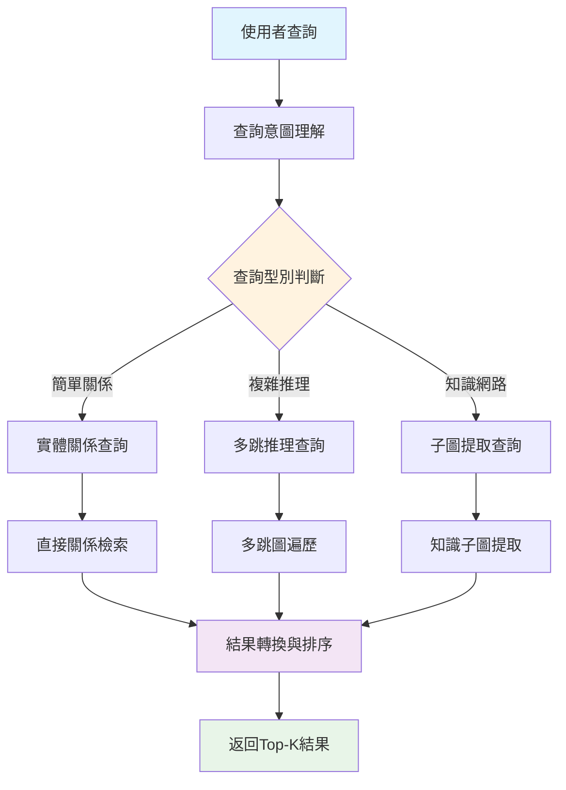

# 第四節 智慧查詢路由與檢索策略

> 不同型別的查詢需要不同的檢索策略。本節將詳細介紹如何構建智慧查詢路由器，實現查詢複雜度分析和檢索策略的自動選擇，以及三種核心檢索策略的設計與實現。

## 一、智慧查詢路由器設計

### 1.1 查詢路由的必要性

在圖RAG系統中，可以實現更多樣化的查詢型別：

**簡單查詢**：
- "川菜有哪些？"
- "宮保雞丁怎麼做？"
- "減肥菜推薦"

**複雜推理查詢**：
- "適合糖尿病人吃的低糖川菜有哪些，並且製作時間不超過30分鐘？"
- "如果我只有雞肉和蔬菜，能做什麼菜，最好是不同菜系的？"
- "哪些菜可以用豆腐替代肉類，並且保持相似的口感？"

**中等複雜查詢**：
- "家常菜中哪些適合新手製作？"
- "有什麼菜可以用剩餘的土豆和胡蘿蔔？"

不同複雜度的查詢需要不同的檢索策略來獲得最佳效果。

### 1.2 查詢分析框架

智慧查詢路由器透過四個維度分析查詢特徵：

```python
class IntelligentQueryRouter:
    def __init__(self, traditional_retrieval, graph_rag_retrieval, llm_client, config):
        self.traditional_retrieval = traditional_retrieval
        self.graph_rag_retrieval = graph_rag_retrieval
        self.llm_client = llm_client
        self.config = config

        # 路由統計
        self.route_stats = {
            "traditional_count": 0,
            "graph_rag_count": 0,
            "combined_count": 0,
            "total_queries": 0
        }

    def analyze_query(self, query: str) -> QueryAnalysis:
        """深度分析查詢特徵，決定最佳檢索策略"""

        analysis_prompt = f"""
        作為RAG系統的查詢分析專家，請深度分析以下查詢的特徵：

        查詢：{query}

        請從以下維度分析：

        1. 查詢複雜度 (0-1)：
           - 0.0-0.3: 簡單資訊查詢（如：紅燒肉怎麼做？）
           - 0.4-0.7: 中等複雜度（如：川菜有哪些特色菜？）
           - 0.8-1.0: 高複雜度推理（如：為什麼川菜用花椒而不是胡椒？）

        2. 關係密集度 (0-1)：
           - 0.0-0.3: 單一實體資訊（如：西紅柿的營養價值）
           - 0.4-0.7: 實體間關係（如：雞肉配什麼蔬菜？）
           - 0.8-1.0: 複雜關係網路（如：川菜的形成與地理、歷史的關係）

        3. 推理需求：是否需要多跳推理、因果分析、對比分析？
        4. 實體識別：查詢中包含多少個明確實體？

        基於分析推薦檢索策略：
        - hybrid_traditional: 適合簡單直接的資訊查詢
        - graph_rag: 適合複雜關係推理和知識發現
        - combined: 需要兩種策略結合

        返回JSON格式：
        {{
            "query_complexity": 0.6,
            "relationship_intensity": 0.8,
            "reasoning_required": true,
            "entity_count": 3,
            "recommended_strategy": "graph_rag",
            "confidence": 0.85,
            "reasoning": "該查詢涉及多個實體間的複雜關係，需要圖結構推理"
        }}
        """

        try:
            response = self.llm_client.chat.completions.create(
                model=self.config.llm_model,
                messages=[{"role": "user", "content": analysis_prompt}],
                temperature=0.1,
                max_tokens=800
            )

            result = json.loads(response.choices[0].message.content.strip())

            # 構建QueryAnalysis物件
            analysis = QueryAnalysis(
                query_complexity=result.get("query_complexity", 0.5),
                relationship_intensity=result.get("relationship_intensity", 0.5),
                reasoning_required=result.get("reasoning_required", False),
                entity_count=result.get("entity_count", 1),
                recommended_strategy=SearchStrategy(result.get("recommended_strategy", "hybrid_traditional")),
                confidence=result.get("confidence", 0.5),
                reasoning=result.get("reasoning", "預設分析")
            )

            return analysis

        except Exception as e:
            logger.error(f"查詢分析失敗: {e}")
            # 降級方案：基於規則的簡單分析
            return self._rule_based_analysis(query)
```

### 1.3 規則基礎的降級分析

當LLM分析失敗時，使用基於規則的降級分析：

```python
def _rule_based_analysis(self, query: str) -> QueryAnalysis:
    """基於規則的降級分析"""
    # 簡單的規則判斷
    complexity_keywords = ["為什麼", "如何", "關係", "影響", "原因", "比較", "區別"]
    relation_keywords = ["配", "搭配", "組合", "相關", "聯絡", "連線"]

    complexity = sum(1 for kw in complexity_keywords if kw in query) / len(complexity_keywords)
    relation_intensity = sum(1 for kw in relation_keywords if kw in query) / len(relation_keywords)

    # 策略選擇
    if complexity > 0.3 or relation_intensity > 0.3:
        strategy = SearchStrategy.GRAPH_RAG
    else:
        strategy = SearchStrategy.HYBRID_TRADITIONAL

    return QueryAnalysis(
        query_complexity=complexity,
        relationship_intensity=relation_intensity,
        reasoning_required=complexity > 0.3,
        entity_count=len(query.split()),  # 簡單估算
        recommended_strategy=strategy,
        confidence=0.6,
        reasoning="基於規則的簡單分析"
    )
```

### 1.4 智慧路由執行

基於分析結果，路由到最適合的檢索策略：

```python
def route_query(self, query: str, top_k: int = 5) -> Tuple[List[Document], QueryAnalysis]:
    """智慧路由查詢到最適合的檢索引擎"""
    logger.info(f"開始智慧路由: {query}")

    # 1. 分析查詢特徵
    analysis = self.analyze_query(query)

    # 2. 更新統計
    self._update_route_stats(analysis.recommended_strategy)

    # 3. 根據策略執行檢索
    try:
        if analysis.recommended_strategy == SearchStrategy.HYBRID_TRADITIONAL:
            logger.info("使用傳統混合檢索")
            documents = self.traditional_retrieval.hybrid_search(query, top_k)

        elif analysis.recommended_strategy == SearchStrategy.GRAPH_RAG:
            logger.info("🕸️ 使用圖RAG檢索")
            documents = self.graph_rag_retrieval.graph_rag_search(query, top_k)

        elif analysis.recommended_strategy == SearchStrategy.COMBINED:
            logger.info("🔄 使用組合檢索策略")
            documents = self._combined_search(query, top_k)

        # 4. 結果後處理
        documents = self._post_process_results(documents, analysis)

        return documents, analysis

    except Exception as e:
        logger.error(f"查詢路由失敗: {e}")
        # 降級到傳統檢索
        documents = self.traditional_retrieval.hybrid_search(query, top_k)
        return documents, analysis

def _combined_search(self, query: str, top_k: int) -> List[Document]:
    """組合搜尋策略：結合傳統檢索和圖RAG的優勢"""
    # 分配結果數量
    traditional_k = max(1, top_k // 2)
    graph_k = top_k - traditional_k

    # 執行兩種檢索
    traditional_docs = self.traditional_retrieval.hybrid_search(query, traditional_k)
    graph_docs = self.graph_rag_retrieval.graph_rag_search(query, graph_k)

    # 合併和去重（簡化實現）
    # ... 具體的合併邏輯

    return combined_docs
```

## 二、三種檢索策略詳解

### 2.1 傳統混合檢索策略

> [混合檢索模組程式碼](https://github.com/datawhalechina/all-in-rag/blob/main/code/C9/rag_modules/hybrid_retrieval.py)

適用於簡單查詢，結合雙層檢索、向量檢索和BM25關鍵詞檢索，透過RRF融合三路結果：

```python
class HybridRetrievalModule:
    def hybrid_search(self, query: str, top_k: int = 5) -> List[Document]:
        """
        混合檢索：三路召回（圖鍵值雙層 + 向量 + BM25）→ RRF 融合
        """
        logger.info(f"開始混合檢索（dual + vector + bm25, RRF k={_RRF_K}）: {query}")

        # 每路給 RRF 留夠候選空間，否則三路各自前 top_k 容易沒交集，融合退化
        candidate_k = max(top_k * 2, 10)

        # 1. 雙層檢索（實體+主題檢索）
        dual_docs = self.dual_level_retrieval(query, candidate_k)

        # 2. 增強向量檢索
        vector_docs = self.vector_search_enhanced(query, candidate_k)

        # 3. BM25 關鍵詞檢索（jieba 分詞 + 停用詞過濾）
        bm25_docs = self.bm25_search(query, candidate_k)

        # 標記每路來源
        for d in dual_docs:
            d.metadata.setdefault("search_method", "dual_level")
        for d in vector_docs:
            d.metadata["search_method"] = "vector"

        # 4. RRF 融合三路結果
        final_docs = self._rrf_merge(
            ranked_lists=[
                ("dual_level", dual_docs),
                ("vector", vector_docs),
                ("bm25", bm25_docs),
            ],
            top_k=top_k,
        )

        # 5. 可選：父文件回填（命中 chunk → 整篇父菜譜，保證上下文完整性）
        if getattr(self.config, "enable_parent_doc_retrieval", False):
            final_docs = self._attach_parent_documents(final_docs)

        return final_docs
```

**RRF（Reciprocal Rank Fusion）融合原理**：RRF 是一種經典的多路檢索結果融合演算法（Cormack et al. 2009），其核心公式為 `score(d) = Σ 1/(k + rank_i(d))`，其中 `k` 為平滑常數（預設60）。每個文件在各檢索通道中的排名被轉化為分數後求和，在三路檢索中均獲得較高排名的文件會被顯著提升，實現"三路共識"優先。RRF 按 `node_id` 對同一菜譜的多個 chunk 去重，只保留最佳排名的 chunk 作為代表。

**父文件回填（Parent Document Retrieval）**：由於文件按 `\n## ` 二級標題切分，長菜譜的步驟段（`### 第i步`）可能被分到非首個 chunk，而 RRF 按 `node_id` 去重後每道菜只保留一個勝出 chunk——這導致步驟類問題的上下文可能缺失關鍵資訊。開啟 `enable_parent_doc_retrieval` 後，RRF 去重後的前 N 條結果會被替換為完整的父菜譜文件（超長截斷兜底），從"chunk 命中"變為"整篇菜譜進上下文"，確保回答的完整性。該功能預設關閉，不影響原有行為。

### 2.2 圖RAG檢索策略

> [圖RAG檢索模組程式碼](https://github.com/datawhalechina/all-in-rag/blob/main/code/C9/rag_modules/graph_rag_retrieval.py)

適用於複雜推理查詢，基於圖結構進行多跳推理：

```python
class GraphRAGRetrieval:
    def graph_rag_search(self, query: str, top_k: int = 5) -> List[Document]:
        """
        圖RAG主搜尋介面：整合所有圖RAG能力
        """
        logger.info(f"開始圖RAG檢索: {query}")

        # 1. 查詢意圖理解
        graph_query = self.understand_graph_query(query)
        logger.info(f"查詢型別: {graph_query.query_type.value}")

        results = []

        try:
            # 2. 根據查詢型別執行不同策略
            if graph_query.query_type in [QueryType.MULTI_HOP, QueryType.PATH_FINDING]:
                # 多跳遍歷
                paths = self.multi_hop_traversal(graph_query)
                results.extend(self._paths_to_documents(paths, query))

            elif graph_query.query_type == QueryType.SUBGRAPH:
                # 子圖提取
                subgraph = self.extract_knowledge_subgraph(graph_query)

                # 圖結構推理
                reasoning_chains = self.graph_structure_reasoning(subgraph, query)

                results.extend(self._subgraph_to_documents(subgraph, reasoning_chains, query))

            elif graph_query.query_type == QueryType.ENTITY_RELATION:
                # 實體關係查詢
                paths = self.multi_hop_traversal(graph_query)
                results.extend(self._paths_to_documents(paths, query))

            # 3. 圖結構相關性排序
            results = self._rank_by_graph_relevance(results, query)

            return results[:top_k]

        except Exception as e:
            logger.error(f"圖RAG檢索失敗: {e}")
            return []
```

**圖RAG檢索流程**：



**多跳推理**：

多跳推理是指透過圖中的多個節點和關係進行間接推理，這是圖RAG相比傳統RAG的核心優勢。傳統檢索只能找到直接匹配的資訊，而多跳推理能夠發現資料中的隱含關聯。

- **工作原理**：
  1. **路徑發現**：在知識圖譜中尋找連線起始實體和目標實體的路徑
  2. **關係傳遞**：透過中間節點傳遞語義關係
  3. **隱含推理**：發現原始資料中沒有明確表達的知識關聯

- **具體示例**：使用者問"雞肉配什麼蔬菜好？"

  ```
  傳統檢索：只能找到直接提到"雞肉+蔬菜"的文件（可能很少）

  多跳推理：
  1跳：雞肉 → 宮保雞丁、口水雞、白切雞...
  2跳：宮保雞丁 → 胡蘿蔔、青椒、花生米...
  3跳：胡蘿蔔 → 蔬菜類別

  推理結果：雞肉經常與胡蘿蔔、青椒等蔬菜搭配
  ```

- **多跳推理的價值**：
  - **知識發現**：挖掘資料中的隱含關係
  - **推薦增強**：提供更豐富的搭配建議
  - **語義理解**：模擬人類的聯想思維過程
  - **資料利用**：充分利用圖結構的關係資訊

透過這種多跳遍歷，系統能發現"雞肉"和"胡蘿蔔"之間的隱含關係：它們經常在同一道菜中出現，即使在原始資料中沒有直接的"雞肉-胡蘿蔔"關係。

### 2.3 組合檢索策略

> [智慧查詢路由器程式碼](https://github.com/datawhalechina/all-in-rag/blob/main/code/C9/rag_modules/intelligent_query_router.py)

適用於中等複雜查詢，結合傳統檢索和圖RAG的優勢：

```python
def _combined_search(self, query: str, top_k: int) -> List[Document]:
    """組合搜尋策略：結合傳統檢索和圖RAG的優勢"""
    # 分配結果數量
    traditional_k = max(1, top_k // 2)
    graph_k = top_k - traditional_k

    # 執行兩種檢索
    traditional_docs = self.traditional_retrieval.hybrid_search(query, traditional_k)
    graph_docs = self.graph_rag_retrieval.graph_rag_search(query, graph_k)

    # Round-robin輪詢合併（參考LightRAG的融合策略）
    combined_docs = []
    seen_contents = set()

    # 交替新增結果，保持多樣性（Round-robin策略）
    max_len = max(len(traditional_docs), len(graph_docs))
    for i in range(max_len):
        # 新增傳統檢索結果
        if i < len(traditional_docs):
            doc = traditional_docs[i]
            if doc.page_content not in seen_contents:
                seen_contents.add(doc.page_content)
                doc.metadata["search_strategy"] = "traditional"
                combined_docs.append(doc)

        # 新增圖RAG結果
        if i < len(graph_docs):
            doc = graph_docs[i]
            if doc.page_content not in seen_contents:
                seen_contents.add(doc.page_content)
                doc.metadata["search_strategy"] = "graph_rag"
                combined_docs.append(doc)

    return combined_docs[:top_k]
```

**Round-robin輪詢合併機制**：在組合檢索中，Round-robin演算法按照固定的輪轉順序從傳統檢索和圖RAG檢索的結果中交替選擇文件。具體過程是：第1個位置選擇傳統檢索的第1個結果，第2個位置選擇圖RAG的第1個結果，第3個位置選擇傳統檢索的第2個結果，以此類推。這種機制避免了複雜的分數融合計算，透過位置輪轉自然實現了不同檢索策略結果的均衡分佈，是一種簡單而有效的多源資訊融合方法。

## 三、路由決策邏輯

智慧查詢路由器透過分析查詢特徵，自動選擇最適合的檢索策略：

**決策規則**：
- **簡單查詢**（複雜度 < 0.4）→ 傳統混合檢索
- **複雜推理查詢**（複雜度 > 0.7 或關係密集度 > 0.7）→ 圖RAG檢索
- **中等複雜查詢**（0.4 ≤ 複雜度 ≤ 0.7）→ 組合檢索策略

**路由統計與最佳化**：

```python
def _update_route_stats(self, strategy: SearchStrategy):
    """更新路由統計資訊"""
    self.route_stats["total_queries"] += 1
    if strategy == SearchStrategy.HYBRID_TRADITIONAL:
        self.route_stats["traditional_count"] += 1
    elif strategy == SearchStrategy.GRAPH_RAG:
        self.route_stats["graph_rag_count"] += 1
    elif strategy == SearchStrategy.COMBINED:
        self.route_stats["combined_count"] += 1
```

> 最後的生成部分就不過多贅述了，和第八章類似，可以自行查閱程式碼。本章專案並不完善，僅作為對 GraphRAG 流程和架構的理解。可根據前面所學內容自行最佳化。
>
> [What-to-eat-today 給當前專案加個前端並做了點最佳化，可以參考](https://github.com/FutureUnreal/What-to-eat-today)
